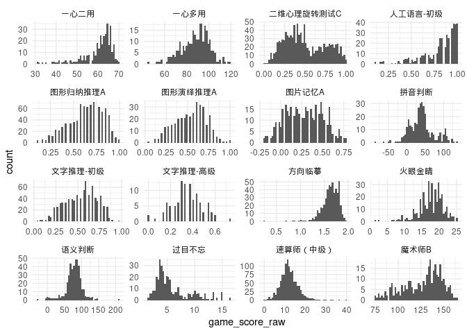
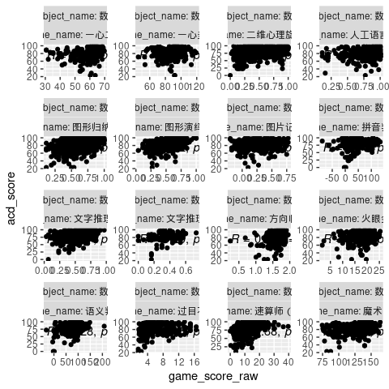

<!-- README.md is generated from README.Rmd. Please edit that file -->

# report.iqz

<!-- badges: start -->
<!-- badges: end -->

The goal of report.iqz is to establish a pipeline of making report for
IQUIZOO data.

## Background

IQUIZOO is now a developing company shipped with a bunch of games
assessing psychological constructs. These games are used to test and
training the students in school, and then a feedback report will be send
to the school. Because the model needs to be checked every time, and
sometimes needs to be modified, the pipeline of making report can not be
automated. However, with some utilities function and automating part of
pipeline, this package is expected to save the time of making a report.

## Installation

You can install the released version of report.iqz from
[Github](https://github.com/) with:

``` r
# install.packages("devtools")
devtools::install_github("Blockhead-yj/report.iqz")
```

## Example Pipeline

This is a basic example illustrate the basic pipeline of making report
for IQUIZOO data. Actually, this package only contains the prediction
part of report now. The basic statistic part will be integrated in this
package in the future.

### Prepare Data

IQUIZOO data can be downloaded using package
[tarflow.iquizoo](http://github.com/psychelzh/tarflow.iquizoo/), the
demo data is a example with user information hidden. Academic data is
usually a excel file, and it can vary between different school, grade
and class. But the most important information in academic excel file is
student name, subject name and subject score, you just need wrangle the
raw data to a long data.frame with these three column.

### Viewing data

#### Data *scores*

``` r
head(as_tibble(scores), 5)
#> # A tibble: 5 x 8
#>   user_org_id  user_id   course_name game_id  game_name game_time game_score_raw
#>   <chr>        <chr>     <chr>       <chr>    <chr>     <chr>              <dbl>
#> 1 cc8c687a-e5… 597bfb58… 学习力快速… fe1c201… 二维心理… 2020-12-…           0.52
#> 2 435bf0b6-f0… a6faba6d… 学习力快速… fe1c201… 二维心理… 2020-12-…           0.22
#> 3 4f0d2a71-d1… 6725366a… 学习力快速… fe1c201… 二维心理… 2020-12-…           0.34
#> 4 78027640-b3… f377462e… 学习力快速… fe1c201… 二维心理… 2020-12-…           0.46
#> 5 060a1e42-d7… 8f9a7547… 学习力快速… fe1c201… 二维心理… 2020-12-…           0.28
#> # … with 1 more variable: game_score_std <dbl>
```

There are 8 columns in *scores*, user\_org\_id, user\_id, course\_name,
game\_id, game\_name, game\_time, game\_score\_raw, game\_score\_std.
The most important columns are **user\_id**, **game\_name**,
**game\_score\_raw** and **game\_score\_std**. Sometimes we also need
**game\_time** to get the first score in a game of a person if he/she
has more than one score in the game.

#### Data *users*

``` r
head(users, 5)
#> # A tibble: 5 x 10
#>   user_id user_name user_sex user_dob school province city  district grade class
#>   <chr>   <chr>     <chr>    <chr>    <chr>  <chr>    <chr> <chr>    <chr> <chr>
#> 1 5d7581… demo5f26… 女       2008-01… demo_… demo_pr… demo… demo_di… 初一  3班  
#> 2 5ede58… demo7956… 男       2007-11… demo_… demo_pr… demo… demo_di… 初一  3班  
#> 3 5e79e9… demo9645… 男       2008-01… demo_… demo_pr… demo… demo_di… 初一  3班  
#> 4 39f274… demo6f56… 女       2007-11… demo_… demo_pr… demo… demo_di… 初一  3班  
#> 5 de45b9… demo5ba5… 男       2008-01… demo_… demo_pr… demo… demo_di… 初一  3班
```

There are 10 columns in *scores*, user\_id, user\_name, user\_sex,
user\_dob, school, province, city, district, grade, class. The most
important columns are **user\_id**, **user\_name**. Sometimes we also
need **user\_dob**, **grade** or **school** for further analysis.

#### Data *academic*

``` r
head(academic, 5)
#> # A tibble: 5 x 9
#> # Rowwise: 
#>   班级  考号     姓名           语文  数学  英语  科学  社会  总分
#>   <chr> <chr>    <chr>         <dbl> <dbl> <dbl> <dbl> <dbl> <dbl>
#> 1 1     20090101 demo964601739    84    98    96    97    97   472
#> 2 1     20090140 demo5904e09e2    79    99    95    92    93   458
#> 3 1     20090109 demo63e4f9713    83    88    88    92    89   440
#> 4 1     20090124 demo673903743    80    89    91    89    89   438
#> 5 1     20090147 demo673821       76    91    92    87    92   438
```

Actually academic data can vary between different school, grade and
class. This example is one of them. You should just keep in mind that
the most important information in academic data is **name**, **subject
name** and **subject score**. You can wrangle it to a long data.frame
containing these three columns, while **ID** sometimes can be useful if
the name is duplicated.

``` r
tidy_acd <- academic %>% 
  pivot_longer(cols = any_of(subjects), names_to = "subject_name", values_to = "acd_score")
```

### Manual review

This step is the beginning of analysis, you should check if the **user**
is duplicate, if the **game\_score\_raw** of one person is duplicate,
and if there are outliers. Data *users* and *academic* if often good,
but the data *scores* is quiet dirty.

#### distribution(normality)

Then you should check the distribution of **game\_score\_raw**, here is
the first utility function, ***plot\_distribution***.

``` r
plot_distribution(data = scores, ob_value = "game_score_raw", group = ~game_name, bins = 50)
```


This function accept a data.frame with format as data *scores*, if you
didn’t change the structure of *scores*, you can just put it into the
function. For other situation, you should give the column name of
observation value(arg **ob\_value** ) and a formula indicate the facet
variable(s)(arg **group** ).

#### Two variables distribution(scatters)

After check the distribution of single variable, you should also check
the distribution of **game\_score\_raw** and **acd\_score**. What you
need here is a function to make a scatter plot, ***plot\_scatter***. To
plot the scatter, you should join *scores* and *academic* together
first.

``` r
game_pfm_with_acd <- scores %>% 
  left_join(users, by = "user_id") %>% 
  inner_join(tidy_acd, by = c("user_name"="姓名")) 

game_pfm_with_acd %>% 
  filter(subject_name == "数学") %>% 
  plot_scatter(data = ., ob_value_x = "game_score_raw", ob_value_y = "acd_score", group = subject_name~game_name, cor = TRUE)
```

 \#\#\#
Select games for model

The second step is selecting games for model. IQUIZOO test lots of
games, we can’t put all games into model for the sake of avoiding
overfitting. Another reason is that there are a lot of missing values
distributed in different games. Some games have too many missing values,
so that we have no choice but to drop these games to get more complete
observations.

#### Select games by finish rate

To get more complete observations, we can drop some games with big
missing rate. This can be done with function ***rate\_GameFinish***. It
will return a tibble with **game\_name** and its **finish\_rate**. If
you want to see the missing pattern, you can specify the argument plot
as TRUE.

``` r
finish_rate <- rate_GameFinish(data = scores, plot = TRUE, idx_game = "game_name", idx_user = "user_id", ob_value = "game_score_raw")
```

 From the
plot above, we can set the finish rate threshold as 0.5, it means we
only preserve the games with finish rate above 0.5.

#### Select by step regression

Now we select predictors(games) by step regression, to continue the
subsequent analysis, we need a wide data.frame with each row represent
all observations of a person. This wide data is convenient for modeling.
This can be done using function ***step\_lm***.

``` r
# prepare wide data
data_wider <- game_pfm_with_acd %>% 
  select(user_id, user_name, game_name, game_score_raw, subject_name, acd_score) %>% 
  mutate(game_name = str_remove_all(game_name, "[（）-]")) %>% 
  pivot_wider(names_from = "game_name", values_from = "game_score_raw", values_fn = median) %>% 
  mutate(across(where(is.numeric), ~ scale(.x)[,1]*15 + 100))
# make different model for different subject
models <- data_wider %>% 
  group_by(subject_name) %>% 
  group_nest() %>% 
  mutate(step_mods = map(
    data,
    ~ step_lm(data_wider = .x, formula = acd_score ~ . -user_id - user_name, trace = FALSE)
  ))
# example model
summary(models$step_mods[[2]])
#> 
#> Call:
#> lm(formula = acd_score ~ 图形归纳推理A + 速算师中级 + 
#>     拼音判断 + 一心多用 + 一心二用 + 方向临摹 + 
#>     文字推理高级, data = complete_data)
#> 
#> Residuals:
#>     Min      1Q  Median      3Q     Max 
#> -4.2560 -0.6799  0.2068  0.7891  2.9928 
#> 
#> Coefficients:
#>               Estimate Std. Error t value Pr(>|t|)    
#> (Intercept)   83.40860    1.78684  46.679  < 2e-16 ***
#> 图形归纳推理A  0.04981    0.01165   4.274 5.09e-05 ***
#> 速算师中级     0.02472    0.01067   2.317   0.0230 *  
#> 拼音判断      -0.01474    0.01019  -1.447   0.1517    
#> 一心多用      -0.02357    0.01162  -2.028   0.0457 *  
#> 一心二用       0.01852    0.01325   1.397   0.1661    
#> 方向临摹       0.02659    0.01021   2.604   0.0109 *  
#> 文字推理高级   0.01978    0.01001   1.976   0.0515 .  
#> ---
#> Signif. codes:  0 '***' 0.001 '**' 0.01 '*' 0.05 '.' 0.1 ' ' 1
#> 
#> Residual standard error: 1.267 on 83 degrees of freedom
#> Multiple R-squared:  0.4724, Adjusted R-squared:  0.4279 
#> F-statistic: 10.61 on 7 and 83 DF,  p-value: 1.819e-09
```

#### Select by relative weight

If there are still more than 5 tasks in model, we think this is not good
for report. So we can (optionally) further select predictors by relative
weight. Relative weight analysis can determine the contribution of every
predictors in model, so you can drop the games with little distribution
to get a neat model. This can be done by function ***select\_by\_RW***.

``` r
models <- models %>% 
  mutate(
    RW_mods = map2(
      data, step_mods,
      ~ {select_by_RW(data_wider = .x, formula = .y, n_task = 5)}
    )
  )
# example model
summary(models$RW_mods[[2]])
#> 
#> Call:
#> lm(formula = as.formula(paste(outcome, "~", paste(predictors, 
#>     collapse = "+"))), data = complete_data)
#> 
#> Residuals:
#>     Min      1Q  Median      3Q     Max 
#> -4.3984 -0.6467  0.0314  0.7666  2.4412 
#> 
#> Coefficients:
#>                Estimate Std. Error t value Pr(>|t|)    
#> (Intercept)   81.556643   1.662259  49.064  < 2e-16 ***
#> 图形归纳推理A  0.047383   0.011910   3.978 0.000145 ***
#> 速算师中级     0.024354   0.010702   2.276 0.025381 *  
#> 一心二用       0.004128   0.011557   0.357 0.721842    
#> 方向临摹       0.030126   0.010330   2.916 0.004530 ** 
#> 文字推理高级   0.013410   0.009897   1.355 0.179027    
#> ---
#> Signif. codes:  0 '***' 0.001 '**' 0.01 '*' 0.05 '.' 0.1 ' ' 1
#> 
#> Residual standard error: 1.299 on 85 degrees of freedom
#> Multiple R-squared:  0.4318, Adjusted R-squared:  0.3984 
#> F-statistic: 12.92 on 5 and 85 DF,  p-value: 2.38e-09
```

#### Check the models

Before final report, you should always check the models to confirm the
model meet statistic requirement, this can be done with package
[performance](https://github.com/easystats/performance).

### Predict and potential judge

After determining the models, we can predict the academic score for
students and make judgment for their academic potential. Since missing
value is too common in our data, sometimes we should predict the
academic score even there are missing predictors in his/her IQUIZOO
data. To achieve this, we calculate the weighted sum of the game score
and it’s coefficient in model. Thus, a complete observation will get the
same predict result as function ***stats::predict*** , but we can also
get prediction for those missing some predictors.

However, we are not going to make predictions for those students who
miss too many predictors, and thus a missing proportion of predictors.
This can be done by function ***calc\_missing\_prop***. Missing
proportion is not simply count the number of missing predictors, but
take their relative weight in models into account. Once the missing
proportion of predictors determined, a arbitrary threshold of 30% will
be used to filter the students who are involved in prediction and
judgment.

#### Calculate the missing proportion of predictos

We need relative weight of predictors to calculate the missing
proportion of predictors, and this was done in the function
***select\_by\_RW***. It will output a lm object with additional
data.frame “rw” in the list. Function ***calc\_missing\_prop*** will add
column on the left of data\_wider.

``` r
models <- models %>% 
  mutate(
    data = map2(
      data, RW_mods,
      ~ calc_missing_prop(data_wider = .x, RelativeWeight = .y$rw)
      )
    )
```

#### Predict and judge potential

Prediction is accomplished by function ***wt\_sum\_predict***, which
accepts **data\_wider** and **model**(the output of
***select\_by\_RW***) and add two columns(**mod\_predict** and
**wt\_sun\_predict**) to **data\_wider**. Potential judgment is
accomplished by function ***judge\_Pot*** , it accepts current academic
score and predict score, output a factor vector whose levels are
predefined **judgment\_lvls**.

``` r
models <- models %>% 
  mutate(
    data = map2(
      data, RW_mods,
      ~ wt_sum_predict(data_wider = .x, model = .y) %>% 
        mutate(judgment = judge_Pot(acd_score, wt_sum_predict))
    )
  )
#> Warning in wt_sum_predict(data_wider = .x, model = .y): There is negative weight, weighted sum is not corrected!

#> Warning in wt_sum_predict(data_wider = .x, model = .y): There is negative weight, weighted sum is not corrected!
```

### Make report

#### Prepare for report

All the analysis has been done, it is time to make report. Here a
function ***prepare\_report*** can summary all the data and models above
to a list of things that can be directly used in model report. Besides
the data and models above, ***prepare\_report*** needs two other things:
**content\_ability** for reporting the corresponding ability of games;
**class\_NL**, class name list for reporting the corresponding class of
students.

``` r
load("./data/content_ability.rda")
content_ability <- content_ability %>% 
  left_join(scores %>% select(game_name, game_id), by = "game_id")
class_NL <- academic %>% 
  select(user_name = 姓名, class = 班级)
mod_reports <- models %>% 
  transmute(
    mod_reports = map2(
      data, RW_mods,
      ~ prepare_report(data_wider = .x, model = .y, abilities = content_ability, class_NL = class_NL, background = FALSE)
    )
  )
```

#### Render the predict report
