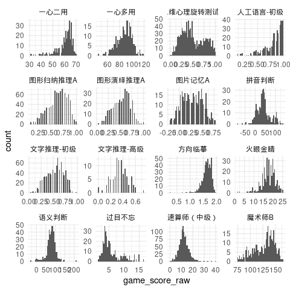
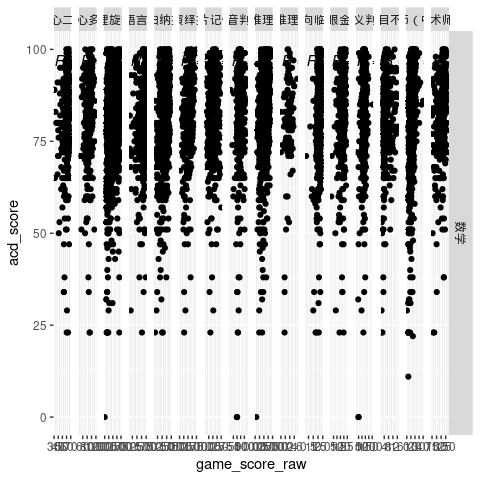
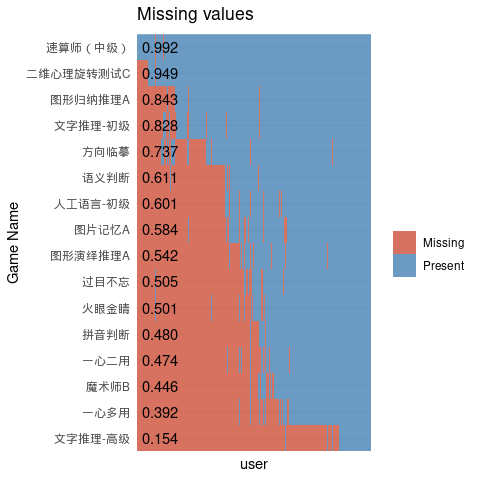

<!-- README.md is generated from README.Rmd. Please edit that file -->

# report.iqz

<!-- badges: start -->
<!-- badges: end -->

The goal of report.iqz is to establish a pipeline of making report for
IQUIZOO data.

## Background

IQUIZOO is now a developing company shipped with a bunch of games
assessing psychological constructs. These games are used to test and
training the students in school, and then a feedback report will be send
to the school. Because the model needs to be checked every time, and
sometimes needs to be modified, the pipeline of making report can not be
automated. However, with some utilities function and automating part of
pipeline, this package is expected to save the time of making a report.

## Installation

You can install the released version of report.iqz from
[Github](https://github.com/) with:

``` r
# install.packages("devtools")
devtools::install_github("Blockhead-yj/report.iqz")
```

## Example Pipeline

This is a basic example illustrate the basic pipeline of making report
for IQUIZOO data. Actually, this package only contains the prediction
part of report now. The basic statistic part will be integrated in this
package in the future.

### Prepare Data

IQUIZOO data can be downloaded using package
[tarflow.iquizoo](http://github.com/psychelzh/tarflow.iquizoo/), the
demo data is a example with user information hidden. Academic data is
usually a excel file, and it can vary between different school, grade
and class. But the most important information in academic excel file is
student name, subject name and subject score, you just need wrangle the
raw data to a long data.frame with these three column.

### Viewing data

#### Data *scores*

``` r
head(as_tibble(scores), 5)
#> # A tibble: 5 × 8
#>   user_org_id     user_id course_name game_id game_name game_time game_score_raw
#>   <chr>           <chr>   <chr>       <chr>   <chr>     <chr>              <dbl>
#> 1 cc8c687a-e5cb-… 597bfb… 学习力快速… fe1c20… 二维心理… 2020-12-…           0.52
#> 2 435bf0b6-f09d-… a6faba… 学习力快速… fe1c20… 二维心理… 2020-12-…           0.22
#> 3 4f0d2a71-d15c-… 672536… 学习力快速… fe1c20… 二维心理… 2020-12-…           0.34
#> 4 78027640-b373-… f37746… 学习力快速… fe1c20… 二维心理… 2020-12-…           0.46
#> 5 060a1e42-d77c-… 8f9a75… 学习力快速… fe1c20… 二维心理… 2020-12-…           0.28
#> # … with 1 more variable: game_score_std <dbl>
```

There are 8 columns in *scores*, user\_org\_id, user\_id, course\_name,
game\_id, game\_name, game\_time, game\_score\_raw, game\_score\_std.
The most important columns are **user\_id**, **game\_name**,
**game\_score\_raw** and **game\_score\_std**. Sometimes we also need
**game\_time** to get the first score in a game of a person if he/she
has more than one score in the game.

#### Data *users*

``` r
head(users, 5)
#> # A tibble: 5 × 10
#>   user_id user_name user_sex user_dob school province city  district grade class
#>   <chr>   <chr>     <chr>    <chr>    <chr>  <chr>    <chr> <chr>    <chr> <chr>
#> 1 5d7581… demo5f26… 女       2008-01… demo_… demo_pr… demo… demo_di… 初一  3班  
#> 2 5ede58… demo7956… 男       2007-11… demo_… demo_pr… demo… demo_di… 初一  3班  
#> 3 5e79e9… demo9645… 男       2008-01… demo_… demo_pr… demo… demo_di… 初一  3班  
#> 4 39f274… demo6f56… 女       2007-11… demo_… demo_pr… demo… demo_di… 初一  3班  
#> 5 de45b9… demo5ba5… 男       2008-01… demo_… demo_pr… demo… demo_di… 初一  3班
```

There are 10 columns in *scores*, user\_id, user\_name, user\_sex,
user\_dob, school, province, city, district, grade, class. The most
important columns are **user\_id**, **user\_name**. Sometimes we also
need **user\_dob**, **grade** or **school** for further analysis.

#### Data *academic*

``` r
head(academic, 5)
#> # A tibble: 5 × 9
#> # Rowwise: 
#>   班级  考号     姓名           语文  数学  英语  科学  社会  总分
#>   <chr> <chr>    <chr>         <dbl> <dbl> <dbl> <dbl> <dbl> <dbl>
#> 1 1     20090101 demo964601739    84    98    96    97    97   472
#> 2 1     20090140 demo5904e09e2    79    99    95    92    93   458
#> 3 1     20090109 demo63e4f9713    83    88    88    92    89   440
#> 4 1     20090124 demo673903743    80    89    91    89    89   438
#> 5 1     20090147 demo673821       76    91    92    87    92   438
```

Actually academic data can vary between different school, grade and
class. This example is one of them. You should just keep in mind that
the most important information in academic data is **name**, **subject
name** and **subject score**. You can wrangle it to a long data.frame
containing these three columns, while **ID** sometimes can be useful if
the name is duplicated.

``` r
tidy_acd <- academic %>% 
  pivot_longer(cols = any_of(subjects), names_to = "subject_name", values_to = "acd_score")
```

### Manual review

This step is the beginning of analysis, you should check if the **user**
is duplicate, if the **game\_score\_raw** of one person is duplicate,
and if there are outliers. Data *users* and *academic* are often good,
but the data *scores* is quiet dirty.

There are some handy functions that can help you review manually, most
of which is started with “plot\_”.

#### distribution(normality)

Then you should check the distribution of **game\_score\_raw**, here is
the first utility function, ***plot\_distribution***.

``` r
plot_distribution(data = scores, x = game_score_raw, group = ~game_name, bins = 50)
```



This function accept a data.frame with format as data *scores*, if you
didn’t change the structure of *scores*, you can just put it into the
function. For other situation, you should give the column name of
observation value(arg **ob\_value** ) and a formula indicate the facet
variable(s)(arg **group** ).

#### Two variables distribution(scatters)

After check the distribution of single variable, you should also check
the distribution of **game\_score\_raw** and **acd\_score**. What you
need here is a function to make a scatter plot, ***plot\_scatter***. To
plot the scatter, you should join *scores* and *academic* together
first.

``` r
game_pfm_with_acd <- scores %>% 
  left_join(users, by = "user_id") %>% 
  inner_join(tidy_acd, by = c("user_name"="姓名")) 

game_pfm_with_acd %>% 
  filter(subject_name == "数学") %>% 
  plot_scatter(data = ., x = game_score_raw, y = acd_score, group = subject_name~game_name, cor = TRUE)
```



### Select games for model

The second step is selecting games for model. IQUIZOO test lots of
games, we can’t put all games into model for the sake of avoiding
overfitting. Another reason is that there are a lot of missing values
distributed in different games. Some games have too many missing values,
so that we have no choice but to drop these games to get more complete
observations.

#### Select games by finish rate

To get more complete observations, we can drop some games with big
missing rate. This can be done with function ***rate\_GameFinish***. It
will return a tibble with **game\_name** and its **finish\_rate**. If
you want to see the missing pattern, you can specify the argument plot
as TRUE.

``` r
finish_rate <- rate_GameFinish(data = scores, idx_game = game_name, idx_user = user_id, ob_value = game_score_raw, plot = TRUE)
```

 From the
plot above, we can set the finish rate threshold as 0.5, it means we
only preserve the games with finish rate above 0.5.

### Modeling&Reporting

After censoring the raw data and developing a pipeline cleaning it, we
are now can modeling the data and report the models. All these can be
done in a Rmarkdown template(for details, see [this
article](https://rstudio.github.io/rstudio-extensions/rmarkdown_templates.html)).

#### Modeling pipeline

1.  Select by step regression
2.  Select by relative weight
3.  Check the models

#### Reporting

1.  Predict and potential judge
2.  Calculate the missing proportion of predictors
3.  Predict and judge potential using weighted sum
4.  Prepare some items for report
5.  Render report
