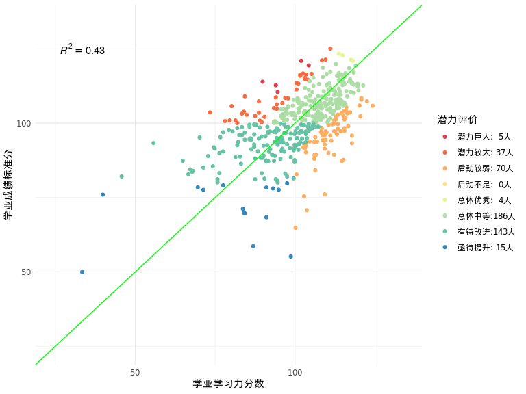
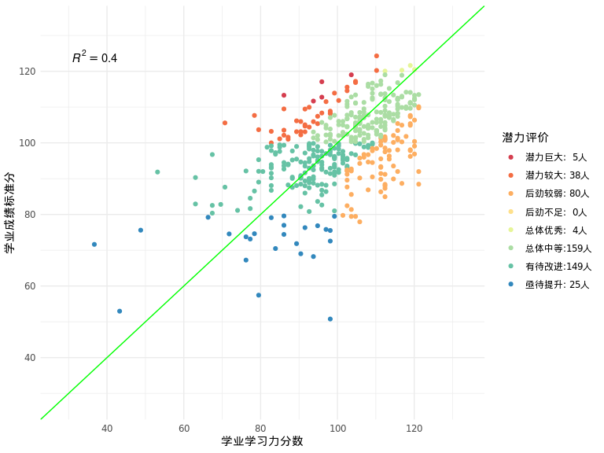
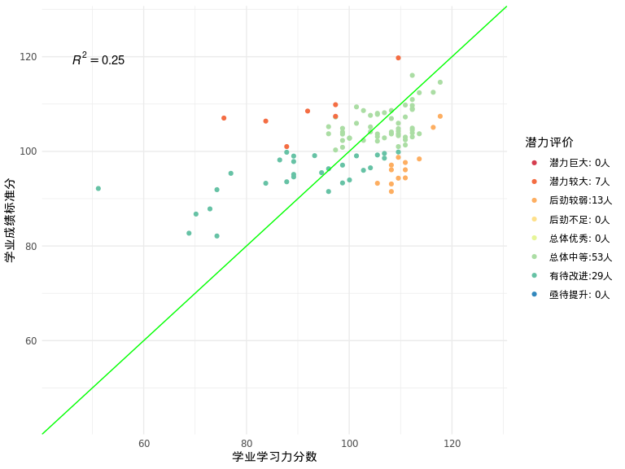
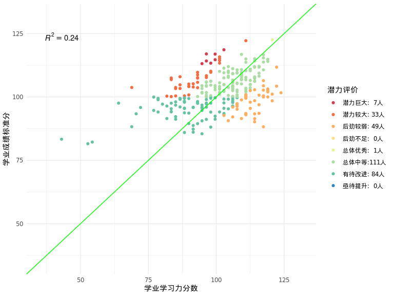

<!-- README.md is generated from README.Rmd. Please edit that file -->

# report.iqz

<!-- badges: start -->
<!-- badges: end -->

The goal of report.iqz is to establish a pipeline of making report for
IQUIZOO data.

## Background

IQUIZOO is now a developing company shipped with a bunch of games
assessing psychological constructs. These games are used to test and
training the students in school, and then a feedback report will be send
to the school. Because the model needs to be checked every time, and
sometimes needs to be modified, the pipeline of making report can not be
automated. However, with some utilities function and automating part of
pipeline, this package is expected to save the time of making a report.

## Installation

You can install the released version of report.iqz from
[Github](https://github.com/) with:

``` r
# install.packages("devtools")
devtools::install_github("Blockhead-yj/report.iqz")
```

## Example Pipeline

This is a basic example illustrate the basic pipeline of making report
for IQUIZOO data. Actually, this package only contains the prediction
part of report now. The basic statistic part will be integrated in this
package in the future.

### Prepare Data

IQUIZOO data can be downloaded using package
[tarflow.iquizoo](http://github.com/psychelzh/tarflow.iquizoo/), the
demo data is a example with user information hidden. Academic data is
usually a excel file, and it can vary between different school, grade
and class. But the most important information in academic excel file is
student name, subject name and subject score, you just need wrangle the
raw data to a long data.frame with these three column.

### Viewing data

#### Data *scores*

``` r
head(as_tibble(scores), 5)
#> # A tibble: 5 × 8
#>   user_org_id  user_id   course_name game_id  game_name game_time game_score_raw
#>   <chr>        <chr>     <chr>       <chr>    <chr>     <chr>              <dbl>
#> 1 cc8c687a-e5… 597bfb58… 学习力快速… fe1c201… 二维心理… 2020-12-…           0.52
#> 2 435bf0b6-f0… a6faba6d… 学习力快速… fe1c201… 二维心理… 2020-12-…           0.22
#> 3 4f0d2a71-d1… 6725366a… 学习力快速… fe1c201… 二维心理… 2020-12-…           0.34
#> 4 78027640-b3… f377462e… 学习力快速… fe1c201… 二维心理… 2020-12-…           0.46
#> 5 060a1e42-d7… 8f9a7547… 学习力快速… fe1c201… 二维心理… 2020-12-…           0.28
#> # … with 1 more variable: game_score_std <dbl>
```

There are 8 columns in *scores*, user\_org\_id, user\_id, course\_name,
game\_id, game\_name, game\_time, game\_score\_raw, game\_score\_std.
The most important columns are **user\_id**, **game\_name**,
**game\_score\_raw** and **game\_score\_std**. Sometimes we also need
**game\_time** to get the first score in a game of a person if he/she
has more than one score in the game.

#### Data *users*

``` r
head(users, 5)
#> # A tibble: 5 × 10
#>   user_id user_name user_sex user_dob school province city  district grade class
#>   <chr>   <chr>     <chr>    <chr>    <chr>  <chr>    <chr> <chr>    <chr> <chr>
#> 1 5d7581… demo5f26… 女       2008-01… demo_… demo_pr… demo… demo_di… 初一  3班  
#> 2 5ede58… demo7956… 男       2007-11… demo_… demo_pr… demo… demo_di… 初一  3班  
#> 3 5e79e9… demo9645… 男       2008-01… demo_… demo_pr… demo… demo_di… 初一  3班  
#> 4 39f274… demo6f56… 女       2007-11… demo_… demo_pr… demo… demo_di… 初一  3班  
#> 5 de45b9… demo5ba5… 男       2008-01… demo_… demo_pr… demo… demo_di… 初一  3班
```

There are 10 columns in *scores*, user\_id, user\_name, user\_sex,
user\_dob, school, province, city, district, grade, class. The most
important columns are **user\_id**, **user\_name**. Sometimes we also
need **user\_dob**, **grade** or **school** for further analysis.

#### Data *academic*

``` r
head(academic, 5)
#> # A tibble: 5 × 9
#> # Rowwise: 
#>   班级  考号     姓名           语文  数学  英语  科学  社会  总分
#>   <chr> <chr>    <chr>         <dbl> <dbl> <dbl> <dbl> <dbl> <dbl>
#> 1 1     20090101 demo964601739    84    98    96    97    97   472
#> 2 1     20090140 demo5904e09e2    79    99    95    92    93   458
#> 3 1     20090109 demo63e4f9713    83    88    88    92    89   440
#> 4 1     20090124 demo673903743    80    89    91    89    89   438
#> 5 1     20090147 demo673821       76    91    92    87    92   438
```

Actually academic data can vary between different school, grade and
class. This example is one of them. You should just keep in mind that
the most important information in academic data is **name**, **subject
name** and **subject score**. You can wrangle it to a long data.frame
containing these three columns, while **ID** sometimes can be useful if
the name is duplicated.

``` r
tidy_acd <- academic %>% 
  pivot_longer(cols = any_of(subjects), names_to = "subject_name", values_to = "acd_score")
```

### Manual review

This step is the beginning of analysis, you should check if the **user**
is duplicate, if the **game\_score\_raw** of one person is duplicate,
and if there are outliers. Data *users* and *academic* if often good,
but the data *scores* is quiet dirty.

#### distribution(normality)

Then you should check the distribution of **game\_score\_raw**, here is
the first utility function, ***plot\_distribution***.

``` r
plot_distribution(data = scores, ob_value = "game_score_raw", group = ~game_name, bins = 50)
```


This function accept a data.frame with format as data *scores*, if you
didn’t change the structure of *scores*, you can just put it into the
function. For other situation, you should give the column name of
observation value(arg **ob\_value** ) and a formula indicate the facet
variable(s)(arg **group** ).

#### Two variables distribution(scatters)

After check the distribution of single variable, you should also check
the distribution of **game\_score\_raw** and **acd\_score**. What you
need here is a function to make a scatter plot, ***plot\_scatter***. To
plot the scatter, you should join *scores* and *academic* together
first.

``` r
game_pfm_with_acd <- scores %>% 
  left_join(users, by = "user_id") %>% 
  inner_join(tidy_acd, by = c("user_name"="姓名")) 

game_pfm_with_acd %>% 
  filter(subject_name == "数学") %>% 
  plot_scatter(data = ., ob_value_x = "game_score_raw", ob_value_y = "acd_score", group = subject_name~game_name, cor = TRUE)
```

 \#\#\#
Select games for model

The second step is selecting games for model. IQUIZOO test lots of
games, we can’t put all games into model for the sake of avoiding
overfitting. Another reason is that there are a lot of missing values
distributed in different games. Some games have too many missing values,
so that we have no choice but to drop these games to get more complete
observations.

#### Select games by finish rate

To get more complete observations, we can drop some games with big
missing rate. This can be done with function ***rate\_GameFinish***. It
will return a tibble with **game\_name** and its **finish\_rate**. If
you want to see the missing pattern, you can specify the argument plot
as TRUE.

``` r
finish_rate <- rate_GameFinish(data = scores, plot = TRUE, idx_game = "game_name", idx_user = "user_id", ob_value = "game_score_raw")
```

 From the
plot above, we can set the finish rate threshold as 0.5, it means we
only preserve the games with finish rate above 0.5.

#### Select by step regression

Now we select predictors(games) by step regression, to continue the
subsequent analysis, we need a wide data.frame with each row represent
all observations of a person. This wide data is convenient for modeling.
This can be done using function ***step\_lm***.

``` r
# prepare wide data
data_wider <- game_pfm_with_acd %>% 
  select(user_id, user_name, game_name, game_score_raw, subject_name, acd_score) %>% 
  mutate(game_name = str_remove_all(game_name, "[（）-]")) %>% 
  pivot_wider(names_from = "game_name", values_from = "game_score_raw", values_fn = median) %>% 
  group_by(subject_name) |> 
  mutate(across(where(is.numeric), ~ scale(.x)[,1]*15 + 100)) |> 
  rename(Z_acd_score = acd_score)
# make different model for different subject
models <- data_wider %>% 
  group_by(subject_name) %>% 
  group_nest() %>% 
  mutate(step_mods = map(
    data,
    ~ step_lm(data_wider = .x, formula = Z_acd_score ~ . -user_id - user_name, trace = FALSE)
  ))
# example model
summary(models$step_mods[[2]])
#> 
#> Call:
#> lm(formula = Z_acd_score ~ 图形归纳推理A + 速算师中级 + 
#>     拼音判断 + 一心多用 + 一心二用 + 方向临摹 + 
#>     文字推理高级, data = complete_data)
#> 
#> Residuals:
#>     Min      1Q  Median      3Q     Max 
#> -37.438  -5.981   1.819   6.941  26.326 
#> 
#> Coefficients:
#>               Estimate Std. Error t value Pr(>|t|)    
#> (Intercept)   10.00936   15.73924   0.636   0.5266    
#> 图形归纳推理A  0.43850    0.10260   4.274 5.09e-05 ***
#> 速算师中级     0.21755    0.09388   2.317   0.0230 *  
#> 拼音判断      -0.12985    0.08975  -1.447   0.1517    
#> 一心多用      -0.20764    0.10236  -2.028   0.0457 *  
#> 一心二用       0.16311    0.11675   1.397   0.1661    
#> 方向临摹       0.23407    0.08989   2.604   0.0109 *  
#> 文字推理高级   0.17467    0.08841   1.976   0.0515 .  
#> ---
#> Signif. codes:  0 '***' 0.001 '**' 0.01 '*' 0.05 '.' 0.1 ' ' 1
#> 
#> Residual standard error: 11.14 on 83 degrees of freedom
#> Multiple R-squared:  0.4724, Adjusted R-squared:  0.4279 
#> F-statistic: 10.61 on 7 and 83 DF,  p-value: 1.819e-09
```

#### Select by relative weight

If there are still more than 5 tasks in model, we think this is not good
for report. So we can (optionally) further select predictors by relative
weight. Relative weight analysis can determine the contribution of every
predictors in model, so you can drop the games with little distribution
to get a neat model. This can be done by function ***select\_by\_RW***.

``` r
models <- models %>% 
  mutate(
    RW_mods = map2(
      data, step_mods,
      ~ {select_by_RW(data_wider = .x, formula = .y, n_task = 5)}
    )
  )
# example model
summary(models$RW_mods[[2]])
#> 
#> Call:
#> lm(formula = as.formula(paste(outcome, "~", paste(predictors, 
#>     collapse = "+"))), data = complete_data)
#> 
#> Residuals:
#>     Min      1Q  Median      3Q     Max 
#> -38.691  -5.689   0.277   6.744  21.474 
#> 
#> Coefficients:
#>               Estimate Std. Error t value Pr(>|t|)    
#> (Intercept)   -6.29337   14.64401  -0.430 0.668460    
#> 图形归纳推理A  0.41713    0.10485   3.978 0.000145 ***
#> 速算师中级     0.21437    0.09420   2.276 0.025381 *  
#> 一心二用       0.03636    0.10180   0.357 0.721842    
#> 方向临摹       0.26523    0.09095   2.916 0.004530 ** 
#> 文字推理高级   0.11845    0.08742   1.355 0.179027    
#> ---
#> Signif. codes:  0 '***' 0.001 '**' 0.01 '*' 0.05 '.' 0.1 ' ' 1
#> 
#> Residual standard error: 11.43 on 85 degrees of freedom
#> Multiple R-squared:  0.4318, Adjusted R-squared:  0.3984 
#> F-statistic: 12.92 on 5 and 85 DF,  p-value: 2.38e-09
```

#### Check the models

Before final report, you should always check the models to confirm the
model meet statistic requirement, this can be done with package
[performance](https://github.com/easystats/performance).

### Predict and potential judge

After determining the models, we can predict the academic score for
students and make judgment for their academic potential. Since missing
value is too common in our data, sometimes we should predict the
academic score even there are missing predictors in his/her IQUIZOO
data. To achieve this, we calculate the weighted sum of the game score
and it’s coefficient in model. Thus, a complete observation will get the
same predict result as function ***stats::predict*** , but we can also
get prediction for those missing some predictors.

However, we are not going to make predictions for those students who
miss too many predictors, and thus a missing proportion of predictors.
This can be done by function ***calc\_missing\_prop***. Missing
proportion is not simply count the number of missing predictors, but
take their relative weight in models into account. Once the missing
proportion of predictors determined, a arbitrary threshold of 30% will
be used to filter the students who are involved in prediction and
judgment.

#### Calculate the missing proportion of predictos

We need relative weight of predictors to calculate the missing
proportion of predictors, and this was done in the function
***select\_by\_RW***. It will output a lm object with additional
data.frame “rw” in the list. Function ***calc\_missing\_prop*** will add
column on the left of data\_wider.

``` r
models <- models %>% 
  mutate(
    data = map2(
      data, RW_mods,
      ~ calc_missing_prop(data_wider = .x, RelativeWeight = .y$rw)
      )
    )
```

#### Predict and judge potential

Prediction is accomplished by function ***wt\_sum\_predict***, which
accepts **data\_wider** and **model**(the output of
***select\_by\_RW***) and add two columns(**mod\_predict** and
**wt\_sun\_predict**) to **data\_wider**. Potential judgment is
accomplished by function ***judge\_Pot*** , it accepts current academic
score and predict score, output a factor vector whose levels are
predefined **judgment\_lvls**.

``` r
models <- models %>% 
  mutate(
    data = map2(
      data, RW_mods,
      ~ wt_sum_predict(data_wider = .x, model = .y) %>% 
        mutate(judgment = judge_Pot(Z_acd_score, wt_sum_predict))
    )
  )
#> Warning in wt_sum_predict(data_wider = .x, model = .y): There is negative weight, weighted sum is not corrected!

#> Warning in wt_sum_predict(data_wider = .x, model = .y): There is negative weight, weighted sum is not corrected!
```

### Make report

#### Prepare for report

All the analysis has been done, it is time to make report. Here a
function ***prepare\_report*** can summary all the data and models above
to a list of things that can be directly used in model report. Besides
the data and models above, ***prepare\_report*** needs two other things:
**content\_ability** for reporting the corresponding ability of games;
**class\_NL**, class name list for reporting the corresponding class of
students.

``` r
load("./data/content_ability.rda")
content_ability <- content_ability %>% 
  left_join(scores %>% select(game_name, game_id), by = "game_id")
class_NL <- academic %>% 
  select(user_name = 姓名, class = 班级)
mod_reports <- models %>% 
  transmute(
    subject_name = subject_name,
    mod_reports = map2(
      data, RW_mods,
      ~ prepare_report(data_wider = .x, model = .y, abilities = content_ability, class_NL = class_NL, background = FALSE)
    )
  )
```

#### Render the predict report

``` r
tmpl_file <- file("./archetypes/report.predict.tmpl.Rmd")
for (i in seq_along(mod_reports$subject_name)) { 
  Curr_subj <- mod_reports$subject_name[[i]]
  Curr_mod_RPT <- mod_reports$mod_reports[[i]]
  knitr::knit_expand(tmpl_file) %>%
    knitr::knit(text = ., quiet = TRUE) %>%
    cat()
  cat("\n\n")
}
```

## 总分

### 总分学业潜力预测模型

针对总分学业成绩标准分，我们用逐步回归的方法找到了与之最相关的几个测评任务，建立了如下的预测模型：

``` r
Curr_mod_RPT$report_rw %>% 
  knitr::kable(caption = str_glue("模型{i}-{Curr_subj}潜力预测"))
```

| 预测变量      | 能力                | 系数 | 相对权重 |
|:--------------|:--------------------|-----:|:---------|
| 图形归纳推理A | 数学推理,思维深刻性 | 0.31 | 33.4%    |
| 方向临摹      | 视觉感知            | 0.17 | 16.2%    |
| 速算师中级    | NA                  | 0.27 | 24.1%    |
| 人工语言初级  | NA                  | 0.16 | 10.5%    |
| 文字推理高级  | NA                  | 0.17 | 15.8%    |

模型1-总分潜力预测

``` r
adj_R2 = Curr_mod_RPT$adj_r2 %>% scales::percent(0.1)
```

该模型用5个测评任务成绩预测了总分学业成绩42.7%的变异，即不同学生在总分成绩上的差异有42.7%可以用这几个测评任务成绩代表的能力解释。

### 总分学业潜力预测和评定

依据这个模型，我们对学生的总分成绩进行了预测。即根据一个学生的各项认知能力分数，预测该学生应该达到的总分成绩（学业学习力分数），并综合考虑该学生的学业学习力分数与现有的学业成绩对其进行潜力评定。

``` r
plot_pred(Curr_mod_RPT)
```



上图展示了模型预测的效果，以及潜力评定的分布。假如模型可以100%的预测学生的学习成绩，则预测值（学业学习力分数）和实际值（学业成绩标准分）应该严格相等，图中的店会精确的落在图中的对角线（绿线）上。实际预测中，由于学业成绩不仅仅受到认知能力的影响，认知能力的测量误差以及单次学业成绩的偶然性因素等原因，预测能力不可能达到100%。故而图中的点会围绕对角线（绿线）附近分布，点在对角线附近的波动越小，说明预测误差越小。

``` r
Curr_mod_RPT$summary_pred %>%  
  knitr::kable(caption = str_glue("潜能评定总表-{Curr_subj}"))
```

| 潜力评价等级 | 人数 | 比例  | 评价等级描述                                                                                                       |
|:-------------|-----:|:------|:-------------------------------------------------------------------------------------------------------------------|
| 潜力巨大     |    5 | 1.1%  | 学业潜能分数高于当前学业成绩标准分很多，而且学业潜能分数在平均水平之上，有巨大的提升潜力                           |
| 潜力较大     |   37 | 8.0%  | 学业潜能分数高于当前学业成绩标准分少许，而且学业潜能分数基本在平均水平之上，仍有较大的提升潜力                     |
| 后劲较弱     |   70 | 15.2% | 学业潜能分数低于当前学业成绩标准分少许,说明当前已经较好的发挥出了自己的潜力，后续提升空间较小                      |
| 总体优秀     |    4 | 0.9%  | 学业潜能分数与当前学业成绩基本相当，而且学业潜能分数在较高水平，总体潜力和已经开发的潜力都很高，总体优秀，继续保持 |
| 总体中等     |  186 | 40.4% | 学业潜能分数与当前学业成绩基本相当，而且学业潜能分数在中上水平，总体潜力和已经开发的潜力都较高，总体中等           |
| 有待改进     |  143 | 31.1% | 学业潜能分数处于中下水平，学业潜能有待通过一定方法改进                                                             |
| 亟待提升     |   15 | 3.3%  | 学业潜能分数处于较低水平，亟需通过一定方法提升潜能                                                                 |

潜能评定总表-总分

| 班级 | 潜力较大                                                                                 | 后劲较弱                                                                                                                                                               | 总体中等                                                                                                                                                                                                                                                                                 | 有待改进                                                                                                                                                                                                                                                                           | 亟待提升                     | 潜力巨大                     | 总体优秀      |
|:-----|:-----------------------------------------------------------------------------------------|:-----------------------------------------------------------------------------------------------------------------------------------------------------------------------|:-----------------------------------------------------------------------------------------------------------------------------------------------------------------------------------------------------------------------------------------------------------------------------------------|:-----------------------------------------------------------------------------------------------------------------------------------------------------------------------------------------------------------------------------------------------------------------------------------|:-----------------------------|:-----------------------------|:--------------|
| 1    | demo964794777                                                                            | demo964601739，demo673821，demo8466588fd，demo753794，demo6a054c8f6                                                                                                    | demo5904e09e2，demo63e4f9713，demo8bb65b，demo6d26c860a，demo54194b5f6，demo9875f24f0，demo964560517，demo9648d1513，demo6236c88f6，demo8d75b5537，demo8d76064e8                                                                                                                         | demo90e91d667，demo674745，demo6744f88f6，demo673592542，demo5f296c59a，demo5f26678c6，demo6764e5747，demo8c277754f，demo84884361f，demo5b86606d0，demo50296e747，demo94b621，demo67666c，demo7385b5616，demo9ec8f7709，demo521521541，demo5b54e09e2，demo5465f68bd，demo5f95f27fd | demo97e96e975，demo54651e602 | NA                           | NA            |
| 10   | demo5216d0                                                                               | demo51a7fc665，demo6c85b54fc，demo5b85fd8fd                                                                                                                            | demo9244e473e，demo6c8610831，demo5f25bb836，demo4f5663654，demo5435b8666，demo8d5827777，demo5216018fd，demo964689777，demo738560971，demo66f60a，demo80482d，demo60053e82b，demo8d7738665，demo6745b551f，demo9f96d64e9，demo6735407c7，demo5218bb8bf，demo9ad745，demo9875925b8       | demo83096494f，demo967529658，demo5e9777，demo738560，demo80e5b84f7，demo4fd67499a，demo84865a560，demo5f954f8f6，demo66f747745，demo623560677，demo65b5b86cf，demo738661                                                                                                          | demo7385a66db                | demo9495fc4e3，demo6768bd742 | NA            |
| 11   | NA                                                                                       | demo5f27d2843，demo80e4fc8c6，demo4fd5b56f4，demo94b9ad，demo8307fb843                                                                                                 | demo52194b695，demo96491d61f，demo5514e05dd，demo738666777，demo9a64e660a，demo6735bb8f8，demo6745e7777，demo96496e5f6，demo846616598，demo5085b594f，demo6f5560665，demo7386895a9，demo5de70e5f6，demo67f6738d14e3，demo80e8f7，demo97e65e4e1，demo6745604e5，demo674754，demo5f262752c | demo94b595963，demo5439759e9，demo67366591d，demo6c89ec60a，demo9645928d8，demo6c8698，demo91d5986b2，demo90e6649e4                                                                                                                                                                | demo5b55428f6                | NA                           | NA            |
| 12   | demo7187395a7，demo76d7458bf，demo6764f5796                                              | demo53f4e04e5，demo90e8fd535，demo54365a59a，demo65b4f796e，demo5085b566f，demo59d739540，demo96465851e                                                                | demo5024f7598，demo8d75b5715，demo536610560，demo9647d2707，demo54179c73c，demo6c854f660，demo5f297554f，demo9646018be，demo6748fe621，demo9645a04ef，demo97e836745，demo6c896e82d，demo5f261a，demo67482c822，demo5f277e777，demo5f98bf，demo4fd559749                                  | demo9647ea668，demo80e6617a0，demo679777719，demo9644e0，demo59d53595f，demo546749747，demo502665719，demo987794963                                                                                                                                                                | demo7385e0                   | NA                           | demo5464f58d3 |
| 13   | demo5f995267a                                                                            | demo67460d595，demo7ba99a5b9，demo90953e6b2，demo9645f2540679，demo6f55ef，demo66f96060f，demo5f99644fc5c7，demo5029754ea，demo90d535658，demo543800963，demo546695946 | demo6746656d9，demo5f25608fd，demo80e5bb5b8，demo5515b58c6，demo82c5bb8be，demo5465924e0，demo8d7623598，demo7386bd，demo65b4e8838，demo5f27c759a，demo9ad5b8666，demo6bd96e6da，demo964667827，demo676769713                                                                            | demo52165a742，demo4f5535，demo6666014e9，demo6c8665595，demo7ae5605bb，demo90d5b87fd，demo6bb661602，demo5355146e9                                                                                                                                                                | demo9646d6592                | demo5f25b5677                | NA            |
| 14   | demo9645b5719，demo4f54f98bf，demo9648275b8                                              | demo5f994e963，demo6c865c742，demo90e60573a，demo7536665bc，demo75380e6ed，demo8486618f8                                                                               | demo79599a660，demo51a7455e0，demo59d5b88f6，demo4f571a5bb，demo6c68275a9，demo5f25fd5a9，demo543663660，demo8d39755b9，demo7388bd5a6，demo6735bb5b8，demo66f785，demo66f558769                                                                                                          | demo6735b87fd，demo848660665，demo9645e096e，demo5215608c6，demo5f25b57ff，demo4fa6d66d0，demo6745606d0，demo5f25a64e9，demo6c84fc97e                                                                                                                                              | demo9ec903605                | NA                           | NA            |
| 2    | demo6736765b54fc，demo90d67460f，demo8096b2，demo5f9689840                               | demo80e53f535，demo6745605b8，demo90d6016db，demo9875f960a                                                                                                             | demo673751661，demo8bb5bb8c6，demo7384f768c，demo7385414ea，demo8bb66f79b，demo590667709，demo674542517，demo6c867d5e0，demo9647fb5ba                                                                                                                                                    | demo6218525ef，demo6bd606742，demo5216615b8，demo9647c75a1，demo6c8955686，demo5f968966f，demo9646958fe，demo5f2560696                                                                                                                                                             | demo80e6cf777，demo5e94fd857 | demo73879c5dd                | NA            |
| 3    | demo94b797658，demo52196e6db                                                             | demo5e38bd，demo51a7fc，demo9f96015f6                                                                                                                                  | demo6c8754，demo6f5661，demo5468bd989，demo5f275382b7af，demo5f26154e4，demo80e6e0626，demo521666                                                                                                                                                                                        | demo55153e4e6，demo91d5b8685                                                                                                                                                                                                                                                       | demo6744e15a7                | NA                           | NA            |
| 4    | demo5f25956b2，demo521660558，demo9645f2670，demo6767458f6，demo5085c973a，demo73897e6db | demo85253e6b2，demo964595535                                                                                                                                           | demo5f2597，demo9675b5，demo5f259257c，demo9884e15eb，demo9646585f6，demo5f27d273a，demo7385b5713，demo848621660                                                                                                                                                                         | demo54697f，demo5f27425cf，demo8486538a0，demo5216325b8，demo73868e6db，demo5f25fc857，demo5464fc4e0，demo6748d7797                                                                                                                                                                | NA                           | NA                           | NA            |
| 5    | demo96196e666，demo673663745，demo5b591d663                                              | demo5f25938d1，demo7a04e8743                                                                                                                                           | demo848777742，demo830807626，demo7ae66167d，demo6c84e0661，demo9a66015b8，demo94b8bd83f，demo676952660，demo5f2601777，demo6c84e5989，demo53596e504，demo5f9653621                                                                                                                      | demo9c86c8946，demo59d59d747，demo7b25465b8，demo66f679，demo88894e6d0，demo7388bf5e0，demo5f952a676，demo8d7777742                                                                                                                                                                | NA                           | demo9ec5a0                   | NA            |
| 6    | demo54396e6b2，demo54370a8c1，demo5544f7598                                              | demo7534f9849，demo4fa4e05b8，demo90e8fd95f，demo967595607，demo6c36b2747                                                                                              | demo5f97778fd，demo5f95b57fb，demo6f561f51e，demo67652b，demo65b60f，demo51a53e6b2，demo6766cf4e8，demo4e06e9，demo5f9794843，demo5435b88bd，demo5f69ad517，demo9a6592745，demo6737a38f6，demo6c697551e，demo53f6667ea，demo8bb96e8bf                                                    | demo59d6584ea，demo97e535660，demo66f79b6cf，demo9648bd，demo9a6535596，demo6215fc58a，demo5f991c，demo8c0903677，demo5c46d6677，demo96451a5b8，demo59d4e05fc，demo9674ee6ca，demo60060561f，demo9a6596，demo94b5b8963                                                             | NA                           | NA                           | demo964964    |
| 7    | demo9ec7096db                                                                            | demo5f96d5822，demo9645958f6，demo7388fb，demo5f296e51e，demo8bb541679，demo9646dd989，demo4f596e77b，demo4f58215a9                                                    | demo508795714，demo6755b8716，demo6c8949595，demo5f2777963，demo8096bc，demo9896b260a，demo4e059583f，demo80e606，demo54374554f，demo9b45b582d                                                                                                                                           | demo7f55b8666，demo9645c55b8，demo5466b68f6，demo6c896e661，demo82a6b2602，demo5435bb665，demo51a745666，demo7a05b5769，demo846660696，demo6745c15cf，demo5215f25b5726，demo94b66161f，demo852970831，demo4e094e5b8，demo9646d7745，demo84898751e                                  | demo6c85bb5b8                | NA                           | NA            |
| 8    | demo9645b58be，demo6748bd4e0，demo9874fc5b8                                              | demo5f27778c6，demo90b7fc4ec，demo5466f273a，demo6c85b88c6，demo5215f6963，demo83a6018fd                                                                               | demo5f99ad83b，demo5f299a60a，demo6796bc，demo9ec9648f6，demo4e07fb83f，demo8659ad827，demo8f69466d6，demo7ba96e99a，demo5f29755e7，demo91d7fc5bb，demo5435a0777，demo90b66f65c，demo5f966671a，demo9647c7963，demo9ec56059a，demo5465b554f，demo6767695b8                               | demo9874fc6d6，demo5f25f6661，demo59d745，demo66f5f6，demo90b7778a0，demo5346016e9，demo76d6b2，demo964660596，demo964827，demo676621616，demo82153e6b2，demo7388bd667，demo7186bc605                                                                                              | demo90d53f963，demo9645bb4e5 | NA                           | demo6735bb903 |
| 9    | demo9ec54f，demo9645b550b，demo53697f6d0，demo5f26cf560，demo5b57b75a5，demo9ec6895bb    | demo5439a8679，demo67353e537，demo5f2769988                                                                                                                            | demo5f251a843，demo5f24e6754，demo8d7689677，demo6c88be77b，demo6735608bd，demo6c6738543660，demo7389465b8，demo7385bb827，demo52b59468c，demo6f58be83f，demo6746d65b8，demo5b5666，demo54354f5b8，demo7ae601963，demo5bc560840，demo6f58d75956df                                        | demo5f95607fc，demo5f25c9，demo7385b5598，demo5435146cf，demo6c85347fd，demo5215b88f6，demo5366b2602，demo6889a6777，demo90d6bc6d6                                                                                                                                                 | demo5f94e0518，demo4fd6665fc | NA                           | demo9ec8bd8be |

学生潜力评定名单-总分

## 数学

### 数学学业潜力预测模型

针对数学学业成绩标准分，我们用逐步回归的方法找到了与之最相关的几个测评任务，建立了如下的预测模型：

``` r
Curr_mod_RPT$report_rw %>% 
  knitr::kable(caption = str_glue("模型{i}-{Curr_subj}潜力预测"))
```

| 预测变量      | 能力                | 系数 | 相对权重 |
|:--------------|:--------------------|-----:|:---------|
| 一心二用      | 分配注意,注意力     | 0.04 | 5.7%     |
| 图形归纳推理A | 数学推理,思维深刻性 | 0.42 | 41.9%    |
| 方向临摹      | 视觉感知            | 0.27 | 24.4%    |
| 速算师中级    | NA                  | 0.21 | 17.5%    |
| 文字推理高级  | NA                  | 0.12 | 10.4%    |

模型2-数学潜力预测

``` r
adj_R2 = Curr_mod_RPT$adj_r2 %>% scales::percent(0.1)
```

该模型用5个测评任务成绩预测了数学学业成绩39.8%的变异，即不同学生在数学成绩上的差异有39.8%可以用这几个测评任务成绩代表的能力解释。

### 数学学业潜力预测和评定

依据这个模型，我们对学生的数学成绩进行了预测。即根据一个学生的各项认知能力分数，预测该学生应该达到的数学成绩（学业学习力分数），并综合考虑该学生的学业学习力分数与现有的学业成绩对其进行潜力评定。

``` r
plot_pred(Curr_mod_RPT)
```



上图展示了模型预测的效果，以及潜力评定的分布。假如模型可以100%的预测学生的学习成绩，则预测值（学业学习力分数）和实际值（学业成绩标准分）应该严格相等，图中的店会精确的落在图中的对角线（绿线）上。实际预测中，由于学业成绩不仅仅受到认知能力的影响，认知能力的测量误差以及单次学业成绩的偶然性因素等原因，预测能力不可能达到100%。故而图中的点会围绕对角线（绿线）附近分布，点在对角线附近的波动越小，说明预测误差越小。

``` r
Curr_mod_RPT$summary_pred %>%  
  knitr::kable(caption = str_glue("潜能评定总表-{Curr_subj}"))
```

| 潜力评价等级 | 人数 | 比例  | 评价等级描述                                                                                                       |
|:-------------|-----:|:------|:-------------------------------------------------------------------------------------------------------------------|
| 潜力巨大     |    5 | 1.1%  | 学业潜能分数高于当前学业成绩标准分很多，而且学业潜能分数在平均水平之上，有巨大的提升潜力                           |
| 潜力较大     |   38 | 8.3%  | 学业潜能分数高于当前学业成绩标准分少许，而且学业潜能分数基本在平均水平之上，仍有较大的提升潜力                     |
| 后劲较弱     |   80 | 17.4% | 学业潜能分数低于当前学业成绩标准分少许,说明当前已经较好的发挥出了自己的潜力，后续提升空间较小                      |
| 总体优秀     |    4 | 0.9%  | 学业潜能分数与当前学业成绩基本相当，而且学业潜能分数在较高水平，总体潜力和已经开发的潜力都很高，总体优秀，继续保持 |
| 总体中等     |  159 | 34.6% | 学业潜能分数与当前学业成绩基本相当，而且学业潜能分数在中上水平，总体潜力和已经开发的潜力都较高，总体中等           |
| 有待改进     |  149 | 32.4% | 学业潜能分数处于中下水平，学业潜能有待通过一定方法改进                                                             |
| 亟待提升     |   25 | 5.4%  | 学业潜能分数处于较低水平，亟需通过一定方法提升潜能                                                                 |

潜能评定总表-数学

| 班级 | 潜力巨大      | 潜力较大                                                                                             | 后劲较弱                                                                                                                              | 总体中等                                                                                                                                                                                                                                                | 有待改进                                                                                                                                                                                                                                                                        | 亟待提升                                    | 总体优秀      |
|:-----|:--------------|:-----------------------------------------------------------------------------------------------------|:--------------------------------------------------------------------------------------------------------------------------------------|:--------------------------------------------------------------------------------------------------------------------------------------------------------------------------------------------------------------------------------------------------------|:--------------------------------------------------------------------------------------------------------------------------------------------------------------------------------------------------------------------------------------------------------------------------------|:--------------------------------------------|:--------------|
| 1    | demo9875f24f0 | demo6d26c860a，demo54194b5f6，demo50296e747                                                          | demo673821，demo8466588fd，demo6a054c8f6，demo674745，demo6744f88f6                                                                   | demo964601739，demo5904e09e2，demo63e4f9713，demo8bb65b，demo964560517，demo6236c88f6，demo8d75b5537，demo8d76064e8，demo964794777，demo5465f68bd                                                                                                       | demo753794，demo90e91d667，demo9648d1513，demo673592542，demo5f296c59a，demo5f26678c6，demo6764e5747，demo84884361f，demo5b86606d0，demo94b621，demo67666c，demo7385b5616，demo9ec8f7709，demo521521541，demo5b54e09e2，demo5f95f27fd                                           | demo8c277754f，demo97e96e975，demo54651e602 | NA            |
| 10   | demo6768bd742 | demo80482d，demo8d7738665                                                                            | demo51a7fc665，demo5435b8666，demo6c85b54fc                                                                                           | demo9244e473e，demo6c8610831，demo5f25bb836，demo4f5663654，demo8d5827777，demo5216018fd，demo964689777，demo738560971，demo66f60a，demo60053e82b，demo6745b551f，demo9495fc4e3，demo9f96d64e9，demo5216d0，demo6735407c7，demo5218bb8bf，demo9875925b8 | demo5b85fd8fd，demo83096494f，demo967529658，demo5e9777，demo738560，demo80e5b84f7，demo9ad745，demo4fd67499a，demo84865a560，demo5f954f8f6，demo66f747745，demo623560677，demo65b5b86cf，demo738661                                                                            | demo7385a66db                               | NA            |
| 11   | NA            | demo6745e7777，demo67f6738d14e3                                                                      | demo5f27d2843，demo4fd5b56f4，demo94b9ad，demo8307fb843                                                                               | demo52194b695，demo96491d61f，demo5514e05dd，demo738666777，demo9a64e660a，demo6735bb8f8，demo96496e5f6，demo846616598，demo80e4fc8c6，demo6f5560665，demo5de70e5f6，demo80e8f7，demo6745604e5，demo674754                                              | demo5085b594f，demo7386895a9，demo97e65e4e1，demo94b595963，demo5439759e9，demo5f262752c，demo67366591d，demo6c89ec60a，demo9645928d8，demo6c8698，demo90e6649e4                                                                                                                | demo5b55428f6，demo91d5986b2                | NA            |
| 12   | NA            | demo5464f58d3，demo76d7458bf，demo6764f5796                                                          | demo53f4e04e5，demo90e8fd535，demo6c854f660，demo5f297554f，demo65b4f796e，demo5085b566f，demo97e836745，demo96465851e，demo80e6617a0 | demo5024f7598，demo8d75b5715，demo536610560，demo9647d2707，demo54179c73c，demo9646018be，demo6748fe621，demo9645a04ef，demo6c896e82d，demo5f261a，demo67482c822，demo5f277e777，demo5f98bf，demo679777719，demo7187395a7                               | demo54365a59a，demo59d739540，demo9647ea668，demo4fd559749，demo9644e0，demo59d53595f，demo546749747，demo502665719，demo987794963                                                                                                                                              | demo7385e0                                  | NA            |
| 13   | NA            | demo5f25b5677                                                                                        | demo67460d595，demo7ba99a5b9，demo90953e6b2，demo9645f2540679，demo6f55ef，demo66f96060f，demo5f99644fc5c7，demo9646d6592，demo4f5535 | demo5f25608fd，demo80e5bb5b8，demo5515b58c6，demo82c5bb8be，demo5465924e0，demo8d7623598，demo7386bd，demo65b4e8838，demo5f27c759a，demo52165a742，demo6bd96e6da，demo964667827，demo5f995267a，demo676769713                                           | demo5029754ea，demo90d535658，demo9ad5b8666，demo6666014e9，demo6c8665595，demo7ae5605bb，demo90d5b87fd，demo6bb661602，demo5355146e9                                                                                                                                           | demo543800963，demo546695946                | demo6746656d9 |
| 14   | demo4f54f98bf | demo9648275b8                                                                                        | demo5f994e963，demo6c865c742，demo90e60573a，demo7536665bc，demo6735bb5b8                                                             | demo79599a660，demo51a7455e0，demo59d5b88f6，demo4f571a5bb，demo6c68275a9，demo5f25fd5a9，demo543663660，demo8d39755b9，demo7388bd5a6，demo6735b87fd，demo9645b5719，demo66f785，demo66f558769                                                          | demo848660665，demo75380e6ed，demo9645e096e，demo5215608c6，demo5f25b57ff，demo4fa6d66d0，demo6745606d0，demo5f25a64e9                                                                                                                                                          | demo8486618f8，demo9ec903605，demo6c84fc97e | NA            |
| 2    | demo90d67460f | demo73879c5dd，demo9647fb5ba，demo5216615b8                                                          | demo80e53f535，demo6745605b8，demo8bb5bb8c6，demo90d6016db                                                                            | demo673751661，demo7384f768c，demo7385414ea，demo8bb66f79b，demo590667709，demo674542517，demo6736765b54fc                                                                                                                                              | demo9875f960a，demo6218525ef，demo6bd606742，demo6c867d5e0，demo9647c75a1，demo6c8955686，demo5f968966f，demo8096b2，demo5f9689840，demo5f2560696                                                                                                                               | demo80e6cf777，demo9646958fe，demo5e94fd857 | NA            |
| 3    | NA            | demo94b797658，demo5468bd989，demo5f275382b7af                                                       | demo6c8754，demo51a7fc，demo6f5661，demo9f96015f6                                                                                     | demo5e38bd，demo52196e6db，demo5f26154e4，demo521666                                                                                                                                                                                                    | demo55153e4e6，demo80e6e0626，demo91d5b8685                                                                                                                                                                                                                                     | demo6744e15a7                               | NA            |
| 4    | NA            | demo9645f2670，demo6767458f6，demo5085c973a，demo73897e6db                                           | demo85253e6b2，demo964595535，demo8486538a0，demo5216325b8                                                                            | demo5f2597，demo9675b5，demo5f259257c，demo9884e15eb，demo5f27d273a，demo7385b5713，demo521660558                                                                                                                                                       | demo54697f，demo9646585f6，demo5f27425cf，demo848621660，demo5f25fc857，demo5464fc4e0，demo6748d7797                                                                                                                                                                            | demo73868e6db                               | demo5f25956b2 |
| 5    | NA            | NA                                                                                                   | demo848777742，demo5f25938d1，demo7a04e8743，demo7b25465b8                                                                            | demo830807626，demo7ae66167d，demo6c84e0661，demo9a66015b8，demo94b8bd83f，demo676952660，demo96196e666，demo673663745，demo6c84e5989，demo5f9653621，demo9ec5a0，demo5b591d663                                                                         | demo9c86c8946，demo59d59d747，demo5f2601777，demo53596e504，demo66f679，demo88894e6d0，demo7388bf5e0，demo5f952a676，demo8d7777742                                                                                                                                              | NA                                          | NA            |
| 6    | demo4e06e9    | demo9a6592745，demo53f6667ea，demo54370a8c1                                                          | demo7534f9849，demo5f97778fd，demo90e8fd95f，demo6766cf4e8，demo967595607，demo97e535660，demo96451a5b8                               | demo4fa4e05b8，demo5f95b57fb，demo6f561f51e，demo67652b，demo65b60f，demo51a53e6b2，demo5f9794843，demo5435b88bd，demo5f69ad517，demo59d6584ea，demo54396e6b2，demo6c697551e，demo8bb96e8bf                                                             | demo6c36b2747，demo6737a38f6，demo66f79b6cf，demo9648bd，demo9a6535596，demo6215fc58a，demo5f991c，demo8c0903677，demo5c46d6677，demo9674ee6ca，demo60060561f，demo5544f7598，demo94b5b8963                                                                                     | demo59d4e05fc，demo9a6596                   | demo964964    |
| 7    | NA            | demo9ec7096db                                                                                        | demo5f96d5822，demo5f296e51e，demo8bb541679，demo4e059583f，demo7f55b8666                                                             | demo508795714，demo9645958f6，demo7388fb，demo6755b8716，demo6c8949595，demo5f2777963，demo8096bc，demo9896b260a，demo80e606，demo54374554f                                                                                                             | demo9646dd989，demo4f596e77b，demo4f58215a9，demo9645c55b8，demo5466b68f6，demo6c896e661，demo82a6b2602，demo5435bb665，demo7a05b5769，demo9b45b582d，demo846660696，demo6745c15cf，demo5215f25b5726，demo94b66161f，demo852970831，demo4e094e5b8，demo9646d7745，demo84898751e | demo6c85bb5b8，demo51a745666                | NA            |
| 8    | NA            | demo5435a0777，demo9647c7963，demo9ec56059a，demo6748bd4e0，demo676621616                            | demo5f99ad83b，demo9ec9648f6，demo5f27778c6，demo90b7fc4ec，demo5466f273a，demo6c85b88c6，demo5215f6963，demo83a6018fd，demo66f5f6    | demo5f299a60a，demo6796bc，demo4e07fb83f，demo8659ad827，demo8f69466d6，demo7ba96e99a，demo5f29755e7，demo91d7fc5bb，demo9645b58be，demo90b66f65c，demo5f966671a                                                                                        | demo9874fc6d6，demo5f25f6661，demo59d745，demo90b7778a0，demo5346016e9，demo5465b554f，demo76d6b2，demo964660596，demo964827，demo6767695b8，demo9874fc5b8，demo82153e6b2，demo7388bd667，demo7186bc605                                                                         | demo90d53f963，demo9645bb4e5                | demo6735bb903 |
| 9    | NA            | demo9ec54f，demo9645b550b，demo5bc560840，demo53697f6d0，demo5f26cf560，demo5b57b75a5，demo9ec6895bb | demo5f24e6754，demo67353e537，demo52b59468c，demo5f95607fc，demo5f25c9，demo5f2769988，demo54354f5b8，demo90d6bc6d6                   | demo5439a8679，demo5f251a843，demo9ec8bd8be，demo8d7689677，demo6c88be77b，demo6735608bd，demo6c6738543660，demo7389465b8，demo7385bb827，demo6f58be83f，demo6746d65b8，demo5b5666                                                                      | demo7385b5598，demo7ae601963，demo5435146cf，demo6c85347fd，demo5215b88f6，demo5366b2602，demo6889a6777，demo6f58d75956df                                                                                                                                                       | demo5f94e0518，demo4fd6665fc                | NA            |

学生潜力评定名单-数学

## 社会

### 社会学业潜力预测模型

针对社会学业成绩标准分，我们用逐步回归的方法找到了与之最相关的几个测评任务，建立了如下的预测模型：

``` r
Curr_mod_RPT$report_rw %>% 
  knitr::kable(caption = str_glue("模型{i}-{Curr_subj}潜力预测"))
```

| 预测变量      | 能力                | 系数 | 相对权重 |
|:--------------|:--------------------|-----:|:---------|
| 图形归纳推理A | 数学推理,思维深刻性 | 0.26 | 31.5%    |
| 文字推理初级  | NA                  | 0.17 | 21.5%    |
| 速算师中级    | NA                  | 0.20 | 16.5%    |
| 人工语言初级  | NA                  | 0.23 | 20.7%    |
| 文字推理高级  | NA                  | 0.10 | 9.7%     |

模型3-社会潜力预测

``` r
adj_R2 = Curr_mod_RPT$adj_r2 %>% scales::percent(0.1)
```

该模型用5个测评任务成绩预测了社会学业成绩33.7%的变异，即不同学生在社会成绩上的差异有33.7%可以用这几个测评任务成绩代表的能力解释。

### 社会学业潜力预测和评定

依据这个模型，我们对学生的社会成绩进行了预测。即根据一个学生的各项认知能力分数，预测该学生应该达到的社会成绩（学业学习力分数），并综合考虑该学生的学业学习力分数与现有的学业成绩对其进行潜力评定。

``` r
plot_pred(Curr_mod_RPT)
```


上图展示了模型预测的效果，以及潜力评定的分布。假如模型可以100%的预测学生的学习成绩，则预测值（学业学习力分数）和实际值（学业成绩标准分）应该严格相等，图中的店会精确的落在图中的对角线（绿线）上。实际预测中，由于学业成绩不仅仅受到认知能力的影响，认知能力的测量误差以及单次学业成绩的偶然性因素等原因，预测能力不可能达到100%。故而图中的点会围绕对角线（绿线）附近分布，点在对角线附近的波动越小，说明预测误差越小。

``` r
Curr_mod_RPT$summary_pred %>%  
  knitr::kable(caption = str_glue("潜能评定总表-{Curr_subj}"))
```

| 潜力评价等级 | 人数 | 比例  | 评价等级描述                                                                                                       |
|:-------------|-----:|:------|:-------------------------------------------------------------------------------------------------------------------|
| 潜力巨大     |   10 | 2.5%  | 学业潜能分数高于当前学业成绩标准分很多，而且学业潜能分数在平均水平之上，有巨大的提升潜力                           |
| 潜力较大     |   38 | 9.6%  | 学业潜能分数高于当前学业成绩标准分少许，而且学业潜能分数基本在平均水平之上，仍有较大的提升潜力                     |
| 后劲较弱     |   80 | 20.3% | 学业潜能分数低于当前学业成绩标准分少许,说明当前已经较好的发挥出了自己的潜力，后续提升空间较小                      |
| 总体优秀     |    2 | 0.5%  | 学业潜能分数与当前学业成绩基本相当，而且学业潜能分数在较高水平，总体潜力和已经开发的潜力都很高，总体优秀，继续保持 |
| 总体中等     |  140 | 35.5% | 学业潜能分数与当前学业成绩基本相当，而且学业潜能分数在中上水平，总体潜力和已经开发的潜力都较高，总体中等           |
| 有待改进     |  120 | 30.5% | 学业潜能分数处于中下水平，学业潜能有待通过一定方法改进                                                             |
| 亟待提升     |    4 | 1.0%  | 学业潜能分数处于较低水平，亟需通过一定方法提升潜能                                                                 |

潜能评定总表-社会

| 班级 | 潜力较大                                                                                 | 后劲较弱                                                                                                                                                                                                      | 总体中等                                                                                                                                                                                                                           | 有待改进                                                                                                                                                                                                                                             | 亟待提升                     | 潜力巨大                     | 总体优秀      |
|:-----|:-----------------------------------------------------------------------------------------|:--------------------------------------------------------------------------------------------------------------------------------------------------------------------------------------------------------------|:-----------------------------------------------------------------------------------------------------------------------------------------------------------------------------------------------------------------------------------|:-----------------------------------------------------------------------------------------------------------------------------------------------------------------------------------------------------------------------------------------------------|:-----------------------------|:-----------------------------|:--------------|
| 1    | demo6d26c860a，demo9875f24f0，demo8d75b5537，demo8d76064e8，demo964794777，demo7385b5616 | demo964601739，demo5904e09e2，demo673821，demo90e91d667                                                                                                                                                       | demo63e4f9713，demo8bb65b，demo54194b5f6，demo964560517，demo9648d1513，demo6236c88f6                                                                                                                                              | demo8466588fd，demo6a054c8f6，demo674745，demo6744f88f6，demo673592542，demo5f296c59a，demo5f26678c6，demo6764e5747，demo8c277754f，demo84884361f，demo5b86606d0，demo94b621，demo67666c，demo9ec8f7709，demo521521541，demo5b54e09e2，demo5f95f27fd | demo97e96e975                | NA                           | NA            |
| 10   | demo9875925b8                                                                            | demo6c8610831，demo51a7fc665，demo964689777，demo5b85fd8fd，demo66f747745，demo65b5b86cf                                                                                                                      | demo9244e473e，demo5f25bb836，demo4f5663654，demo5435b8666，demo8d5827777，demo5216018fd，demo6c85b54fc，demo738560971，demo66f60a，demo80482d，demo60053e82b，demo5218bb8bf，demo5e9777，demo9ad745，demo84865a560                | demo6745b551f，demo83096494f，demo9f96d64e9，demo967529658，demo6735407c7，demo738560，demo80e5b84f7，demo4fd67499a，demo5f954f8f6，demo623560677，demo738661                                                                                        | NA                           | demo9495fc4e3，demo6768bd742 | NA            |
| 11   | NA                                                                                       | demo5f27d2843，demo6745e7777，demo846616598，demo5085b594f，demo80e4fc8c6，demo5de70e5f6，demo94b9ad，demo8307fb843，demo97e65e4e1，demo94b595963，demo5439759e9，demo67366591d，demo6c89ec60a，demo5b55428f6 | demo52194b695，demo96491d61f，demo9a64e660a，demo6735bb8f8，demo96496e5f6，demo6f5560665，demo7386895a9，demo80e8f7，demo5f262752c                                                                                                 | demo6745604e5，demo674754，demo6c8698，demo91d5986b2，demo90e6649e4                                                                                                                                                                                  | NA                           | NA                           | NA            |
| 12   | demo502665719，demo6764f5796                                                             | demo5024f7598，demo90e8fd535，demo536610560，demo54179c73c，demo54365a59a，demo59d739540，demo5f277e777，demo9647ea668                                                                                        | demo8d75b5715，demo9647d2707，demo6c854f660，demo5f297554f，demo9646018be，demo6748fe621，demo97e836745，demo6c896e82d，demo5f261a，demo67482c822，demo5f98bf，demo4fd559749，demo7187395a7                                        | demo65b4f796e，demo96465851e，demo80e6617a0，demo679777719，demo7385e0，demo59d53595f，demo546749747，demo987794963                                                                                                                                  | NA                           | NA                           | demo5464f58d3 |
| 13   | demo676769713，demo5f25b5677                                                             | demo90953e6b2，demo9645f2540679，demo6f55ef，demo82c5bb8be，demo5465924e0，demo5f99644fc5c7，demo5029754ea，demo90d535658，demo543800963，demo52165a742，demo546695946，demo9646d6592                         | demo6746656d9，demo5f25608fd，demo80e5bb5b8，demo5515b58c6，demo7386bd，demo65b4e8838，demo5f27c759a，demo9ad5b8666                                                                                                                | demo8d7623598，demo964667827，demo6c8665595，demo7ae5605bb，demo90d5b87fd，demo6bb661602，demo5355146e9                                                                                                                                              | NA                           | demo5f995267a                | NA            |
| 14   | demo9648275b8，demo4fa6d66d0                                                             | demo5f994e963，demo6c865c742，demo7536665bc，demo6735b87fd，demo8486618f8                                                                                                                                     | demo79599a660，demo51a7455e0，demo90e60573a，demo59d5b88f6，demo4f571a5bb，demo5f25fd5a9，demo543663660，demo8d39755b9，demo6735bb5b8，demo848660665，demo66f785，demo66f558769，demo4f54f98bf                                     | demo7388bd5a6，demo9645e096e，demo5215608c6，demo5f25b57ff，demo6745606d0，demo5f25a64e9，demo6c84fc97e                                                                                                                                              | NA                           | demo9645b5719                | NA            |
| 2    | demo674542517，demo6c867d5e0，demo8096b2，demo5f9689840                                  | demo9875f960a                                                                                                                                                                                                 | demo673751661，demo8bb5bb8c6，demo7384f768c，demo8bb66f79b，demo6218525ef，demo6736765b54fc，demo90d67460f                                                                                                                         | demo90d6016db，demo6bd606742，demo9647fb5ba，demo5216615b8，demo9647c75a1，demo6c8955686，demo5f968966f，demo80e6cf777，demo9646958fe，demo5f2560696                                                                                                 | demo5e94fd857                | demo73879c5dd                | NA            |
| 3    | demo5f275382b7af，demo80e6e0626，demo521666                                              | NA                                                                                                                                                                                                            | demo94b797658，demo6f5661，demo5468bd989，demo5f26154e4                                                                                                                                                                            | demo5e38bd，demo51a7fc，demo91d5b8685                                                                                                                                                                                                                | NA                           | demo52196e6db                | NA            |
| 4    | demo9675b5，demo5f25956b2，demo5f259257c                                                 | demo85253e6b2，demo964595535                                                                                                                                                                                  | demo5f2597，demo738740616，demo54697f，demo9884e15eb，demo9646585f6，demo7385b5713，demo521660558，demo848621660                                                                                                                   | demo5f27425cf，demo5216325b8，demo73868e6db，demo5f25fc857，demo9645f2670，demo6767458f6，demo5464fc4e0                                                                                                                                              | NA                           | NA                           | NA            |
| 5    | demo830807626，demo9a66015b8，demo9ec5a0，demo5b591d663                                  | demo848777742，demo7a04e8743，demo676952660                                                                                                                                                                   | demo5f25938d1，demo7ae66167d，demo94b8bd83f，demo6c84e5989，demo5f9653621                                                                                                                                                          | demo9c86c8946，demo59d59d747，demo5f2601777，demo53596e504，demo66f679，demo7388bf5e0，demo5f952a676，demo8d7777742                                                                                                                                  | NA                           | demo96196e666，demo673663745 | NA            |
| 6    | demo6c697551e，demo54370a8c1，demo9674ee6ca，demo5544f7598                               | demo4fa4e05b8，demo6766cf4e8，demo967595607，demo59d6584ea，demo6c36b2747，demo9648bd，demo9a6535596                                                                                                          | demo7534f9849，demo90e8fd95f，demo5f95b57fb，demo6f561f51e，demo67652b，demo964964，demo51a53e6b2，demo4e06e9，demo5f9794843，demo8bb5bb742，demo5f69ad517，demo9a6592745，demo6737a38f6，demo53f6667ea，demo6215fc58a，demo5f991c | demo5435b88bd，demo97e535660，demo66f79b6cf，demo8c0903677，demo5c46d6677，demo96451a5b8，demo59d4e05fc，demo60060561f，demo9a6596，demo94b5b8963                                                                                                    | NA                           | demo54396e6b2                | NA            |
| 7    | NA                                                                                       | demo7388fb，demo9646dd989，demo4f596e77b，demo80e606，demo4f58215a9，demo51a745666                                                                                                                            | demo5f96d5822，demo508795714，demo9645958f6，demo5f296e51e，demo6755b8716，demo8bb541679，demo6c8949595，demo5f2777963，demo8096bc，demo9896b260a，demo4e059583f，demo9b45b582d                                                    | demo7f55b8666，demo5466b68f6，demo6c896e661，demo82a6b2602，demo7a05b5769，demo846660696，demo6745c15cf，demo94b66161f，demo852970831，demo4e094e5b8，demo9646d7745，demo84898751e                                                                   | NA                           | NA                           | NA            |
| 8    | demo9645b58be，demo9ec56059a，demo6767695b8，demo7388bd667                               | demo9ec9648f6，demo5466f273a，demo7ba96e99a，demo5215f6963，demo83a6018fd，demo9874fc6d6，demo964660596                                                                                                       | demo6735bb903，demo5f299a60a，demo8659ad827，demo90b7fc4ec，demo91d7fc5bb，demo5435a0777，demo5f25f6661，demo59d745，demo90b66f65c，demo5f966671a，demo9647c7963，demo5465b554f                                                    | demo8f69466d6，demo6c85b88c6，demo66f5f6，demo90b7778a0，demo5346016e9，demo964827，demo90d53f963，demo7186bc605                                                                                                                                     | NA                           | NA                           | NA            |
| 9    | demo54354f5b8，demo53697f6d0，demo9ec6895bb                                              | demo5439a8679，demo7385bb827，demo52b59468c，demo6889a6777，demo90d6bc6d6                                                                                                                                     | demo9ec8bd8be，demo5f24e6754，demo8d7689677，demo6c88be77b，demo6735608bd，demo6c6738543660，demo6f58be83f，demo6746d65b8，demo5f25c9，demo5b5666，demo5bc560840，demo6c85347fd                                                    | demo67353e537，demo5f95607fc，demo7385b5598，demo7ae601963，demo5366b2602，demo6f58d75956df，demo4fd6665fc                                                                                                                                           | demo5215b88f6，demo5f94e0518 | demo9645b550b                | demo9ec54f    |

学生潜力评定名单-社会

## 科学

### 科学学业潜力预测模型

针对科学学业成绩标准分，我们用逐步回归的方法找到了与之最相关的几个测评任务，建立了如下的预测模型：

``` r
Curr_mod_RPT$report_rw %>% 
  knitr::kable(caption = str_glue("模型{i}-{Curr_subj}潜力预测"))
```

| 预测变量      | 能力                | 系数 | 相对权重 |
|:--------------|:--------------------|-----:|:---------|
| 图形归纳推理A | 数学推理,思维深刻性 | 0.46 | 45.5%    |
| 方向临摹      | 视觉感知            | 0.19 | 15.1%    |
| 速算师中级    | NA                  | 0.27 | 20.6%    |
| 人工语言初级  | NA                  | 0.16 | 9.5%     |
| 文字推理高级  | NA                  | 0.11 | 9.3%     |

模型4-科学潜力预测

``` r
adj_R2 = Curr_mod_RPT$adj_r2 %>% scales::percent(0.1)
```

该模型用5个测评任务成绩预测了科学学业成绩45.2%的变异，即不同学生在科学成绩上的差异有45.2%可以用这几个测评任务成绩代表的能力解释。

### 科学学业潜力预测和评定

依据这个模型，我们对学生的科学成绩进行了预测。即根据一个学生的各项认知能力分数，预测该学生应该达到的科学成绩（学业学习力分数），并综合考虑该学生的学业学习力分数与现有的学业成绩对其进行潜力评定。

``` r
plot_pred(Curr_mod_RPT)
```


上图展示了模型预测的效果，以及潜力评定的分布。假如模型可以100%的预测学生的学习成绩，则预测值（学业学习力分数）和实际值（学业成绩标准分）应该严格相等，图中的店会精确的落在图中的对角线（绿线）上。实际预测中，由于学业成绩不仅仅受到认知能力的影响，认知能力的测量误差以及单次学业成绩的偶然性因素等原因，预测能力不可能达到100%。故而图中的点会围绕对角线（绿线）附近分布，点在对角线附近的波动越小，说明预测误差越小。

``` r
Curr_mod_RPT$summary_pred %>%  
  knitr::kable(caption = str_glue("潜能评定总表-{Curr_subj}"))
```

| 潜力评价等级 | 人数 | 比例  | 评价等级描述                                                                                                       |
|:-------------|-----:|:------|:-------------------------------------------------------------------------------------------------------------------|
| 潜力巨大     |   10 | 2.2%  | 学业潜能分数高于当前学业成绩标准分很多，而且学业潜能分数在平均水平之上，有巨大的提升潜力                           |
| 潜力较大     |   27 | 5.8%  | 学业潜能分数高于当前学业成绩标准分少许，而且学业潜能分数基本在平均水平之上，仍有较大的提升潜力                     |
| 后劲较弱     |   96 | 20.8% | 学业潜能分数低于当前学业成绩标准分少许,说明当前已经较好的发挥出了自己的潜力，后续提升空间较小                      |
| 总体优秀     |    4 | 0.9%  | 学业潜能分数与当前学业成绩基本相当，而且学业潜能分数在较高水平，总体潜力和已经开发的潜力都很高，总体优秀，继续保持 |
| 总体中等     |  174 | 37.7% | 学业潜能分数与当前学业成绩基本相当，而且学业潜能分数在中上水平，总体潜力和已经开发的潜力都较高，总体中等           |
| 有待改进     |  126 | 27.3% | 学业潜能分数处于中下水平，学业潜能有待通过一定方法改进                                                             |
| 亟待提升     |   25 | 5.4%  | 学业潜能分数处于较低水平，亟需通过一定方法提升潜能                                                                 |

潜能评定总表-科学

| 班级 | 潜力较大                                                                                 | 后劲较弱                                                                                                                                                                              | 总体中等                                                                                                                                                                                                                                                                              | 有待改进                                                                                                                                                                                                                                          | 亟待提升                                    | 潜力巨大                                 | 总体优秀      |
|:-----|:-----------------------------------------------------------------------------------------|:--------------------------------------------------------------------------------------------------------------------------------------------------------------------------------------|:--------------------------------------------------------------------------------------------------------------------------------------------------------------------------------------------------------------------------------------------------------------------------------------|:--------------------------------------------------------------------------------------------------------------------------------------------------------------------------------------------------------------------------------------------------|:--------------------------------------------|:-----------------------------------------|:--------------|
| 1    | demo6d26c860a，demo54194b5f6                                                             | demo964601739，demo63e4f9713，demo673821，demo8466588fd，demo753794，demo6a054c8f6，demo674745，demo6744f88f6，demo5465f68bd                                                          | demo5904e09e2，demo8bb65b，demo9875f24f0，demo964560517，demo6236c88f6，demo8d75b5537，demo8d76064e8，demo964794777                                                                                                                                                                   | demo90e91d667，demo9648d1513，demo673592542，demo5f296c59a，demo5f26678c6，demo6764e5747，demo84884361f，demo5b86606d0，demo50296e747，demo94b621，demo67666c，demo7385b5616，demo9ec8f7709，demo521521541，demo5b54e09e2，demo5f95f27fd          | demo8c277754f，demo97e96e975，demo54651e602 | NA                                       | NA            |
| 10   | NA                                                                                       | demo5f25bb836，demo51a7fc665，demo5b85fd8fd，demo83096494f，demo967529658，demo80e5b84f7，demo5f954f8f6，demo623560677                                                                | demo9244e473e，demo6c8610831，demo4f5663654，demo5435b8666，demo8d5827777，demo5216018fd，demo964689777，demo738560971，demo66f60a，demo80482d，demo60053e82b，demo8d7738665，demo6745b551f，demo9495fc4e3，demo9f96d64e9，demo5216d0，demo6735407c7，demo5218bb8bf，demo9875925b8    | demo6c85b54fc，demo5e9777，demo738560，demo9ad745，demo4fd67499a，demo84865a560，demo66f747745，demo65b5b86cf，demo738661                                                                                                                         | demo7385a66db                               | demo6768bd742                            | NA            |
| 11   | NA                                                                                       | demo80e4fc8c6                                                                                                                                                                         | demo52194b695，demo96491d61f，demo5514e05dd，demo738666777，demo9a64e660a，demo6735bb8f8，demo6745e7777，demo96496e5f6，demo5085b594f，demo6f5560665，demo67f6738d14e3，demo80e8f7，demo97e65e4e1，demo6745604e5，demo674754，demo5f262752c                                           | demo5f27d2843，demo846616598，demo4fd5b56f4，demo7386895a9，demo5de70e5f6，demo94b9ad，demo8307fb843，demo94b595963，demo5439759e9，demo67366591d，demo6c89ec60a，demo9645928d8，demo6c8698，demo90e6649e4                                        | demo5b55428f6，demo91d5986b2                | NA                                       | NA            |
| 12   | demo76d7458bf，demo6764f5796                                                             | demo90e8fd535，demo54365a59a，demo65b4f796e，demo5085b566f，demo59d739540，demo96465851e，demo80e6617a0                                                                               | demo53f4e04e5，demo5024f7598，demo8d75b5715，demo536610560，demo9647d2707，demo54179c73c，demo6c854f660，demo5f297554f，demo9646018be，demo6748fe621，demo9645a04ef，demo97e836745，demo6c896e82d，demo5f261a，demo67482c822，demo5f277e777，demo5f98bf，demo4fd559749，demo7187395a7 | demo9647ea668，demo679777719，demo9644e0，demo59d53595f，demo546749747，demo502665719，demo987794963                                                                                                                                              | demo7385e0                                  | NA                                       | demo5464f58d3 |
| 13   | demo5f25b5677                                                                            | demo67460d595，demo7ba99a5b9，demo9645f2540679，demo6f55ef，demo66f96060f，demo5f99644fc5c7，demo8d7623598，demo5029754ea，demo90d535658，demo543800963，demo546695946，demo9646d6592 | demo5f25608fd，demo80e5bb5b8，demo90953e6b2，demo5515b58c6，demo82c5bb8be，demo5465924e0，demo7386bd，demo65b4e8838，demo5f27c759a，demo9ad5b8666，demo6bd96e6da，demo964667827，demo5f995267a，demo676769713                                                                         | demo52165a742，demo6666014e9，demo6c8665595，demo7ae5605bb，demo90d5b87fd，demo6bb661602，demo5355146e9                                                                                                                                           | demo4f5535                                  | NA                                       | demo6746656d9 |
| 14   | demo5f25fd5a9，demo4f54f98bf，demo9648275b8                                              | demo5f994e963，demo6c865c742，demo7536665bc，demo8486618f8                                                                                                                            | demo79599a660，demo51a7455e0，demo90e60573a，demo59d5b88f6，demo4f571a5bb，demo6c68275a9，demo543663660，demo8d39755b9，demo7388bd5a6，demo6735b87fd，demo9645b5719，demo66f785，demo66f558769                                                                                        | demo6735bb5b8，demo848660665，demo9645e096e，demo5215608c6，demo5f25b57ff，demo4fa6d66d0，demo6745606d0，demo5f25a64e9                                                                                                                            | demo75380e6ed，demo9ec903605，demo6c84fc97e | NA                                       | NA            |
| 2    | demo7385414ea，demo90d67460f，demo9647fb5ba                                              | demo80e53f535，demo6745605b8，demo90d6016db，demo8bb66f79b，demo6bd606742，demo9647c75a1                                                                                              | demo673751661，demo8bb5bb8c6，demo7384f768c，demo590667709，demo674542517，demo6c867d5e0                                                                                                                                                                                              | demo9875f960a，demo6218525ef，demo5216615b8，demo6c8955686，demo5f968966f，demo8096b2，demo5f9689840，demo5f2560696                                                                                                                               | demo80e6cf777，demo9646958fe，demo5e94fd857 | demo6736765b54fc，demo73879c5dd          | NA            |
| 3    | demo52196e6db，demo5468bd989                                                             | demo5e38bd，demo51a7fc，demo9f96015f6，demo55153e4e6                                                                                                                                  | demo6c8754，demo6f5661，demo5f275382b7af，demo5f26154e4，demo521666                                                                                                                                                                                                                   | demo80e6e0626，demo91d5b8685                                                                                                                                                                                                                      | demo6744e15a7                               | demo94b797658                            | NA            |
| 4    | demo7385b5713，demo521660558，demo9645f2670，demo6767458f6，demo5085c973a，demo73897e6db | demo85253e6b2，demo964595535，demo73868e6db                                                                                                                                           | demo5f2597，demo738740616，demo9675b5，demo5f259257c，demo9884e15eb，demo9646585f6，demo5f27d273a                                                                                                                                                                                     | demo54697f，demo5f27425cf，demo8486538a0，demo848621660，demo5f25fc857，demo5464fc4e0，demo6748d7797                                                                                                                                              | demo5216325b8                               | demo5f25956b2                            | NA            |
| 5    | NA                                                                                       | demo7a04e8743，demo59d59d747，demo7b25465b8，demo88894e6d0                                                                                                                            | demo848777742，demo5f25938d1，demo830807626，demo7ae66167d，demo6c84e0661，demo94b8bd83f，demo673663745，demo6c84e5989，demo53596e504，demo5f9653621，demo5b591d663                                                                                                                   | demo9c86c8946，demo676952660，demo5f2601777，demo66f679，demo7388bf5e0，demo5f952a676，demo8d7777742                                                                                                                                              | NA                                          | demo9a66015b8，demo96196e666，demo9ec5a0 | NA            |
| 6    | demo964964，demo54396e6b2，demo54370a8c1，demo5544f7598                                  | demo7534f9849，demo90e8fd95f，demo967595607，demo6c36b2747，demo97e535660，demo66f79b6cf，demo9648bd，demo9a6535596，demo8c0903677，demo5c46d6677                                     | demo5f97778fd，demo4fa4e05b8，demo5f95b57fb，demo6f561f51e，demo67652b，demo65b60f，demo51a53e6b2，demo6766cf4e8，demo4e06e9，demo5f9794843，demo8bb5bb742，demo5435b88bd，demo5f69ad517，demo9a6592745，demo6737a38f6，demo6c697551e，demo53f6667ea，demo8bb96e8bf                   | demo59d6584ea，demo6215fc58a，demo5f991c，demo96451a5b8，demo9674ee6ca，demo60060561f                                                                                                                                                             | demo59d4e05fc，demo9a6596，demo94b5b8963    | NA                                       | NA            |
| 7    | demo9ec7096db                                                                            | demo5f96d5822，demo9645958f6，demo5f296e51e，demo9646dd989，demo6c85bb5b8，demo82a6b2602                                                                                              | demo508795714，demo7388fb，demo6755b8716，demo8bb541679，demo6c8949595，demo5f2777963，demo8096bc，demo9896b260a，demo4e059583f，demo80e606，demo54374554f                                                                                                                            | demo4f596e77b，demo7f55b8666，demo4f58215a9，demo9645c55b8，demo5466b68f6，demo6c896e661，demo5435bb665，demo7a05b5769，demo9b45b582d，demo846660696，demo6745c15cf，demo5215f25b5726，demo94b66161f，demo852970831，demo4e094e5b8，demo84898751e | demo51a745666，demo9646d7745                | NA                                       | NA            |
| 8    | demo90b66f65c，demo5f966671a                                                             | demo9ec9648f6，demo8659ad827，demo5f27778c6，demo90b7fc4ec，demo8f69466d6，demo5466f273a，demo6c85b88c6，demo5215f6963，demo83a6018fd，demo9874fc6d6，demo5346016e9                   | demo5f99ad83b，demo5f299a60a，demo6796bc，demo4e07fb83f，demo7ba96e99a，demo5f29755e7，demo91d7fc5bb，demo5435a0777，demo9647c7963，demo9ec56059a，demo5465b554f，demo6748bd4e0                                                                                                       | demo5f25f6661，demo59d745，demo66f5f6，demo90b7778a0，demo76d6b2，demo964660596，demo964827，demo6767695b8，demo9874fc5b8，demo676621616，demo82153e6b2，demo7388bd667                                                                            | demo90d53f963，demo9645bb4e5，demo7186bc605 | demo9645b58be                            | demo6735bb903 |
| 9    | demo9ec6895bb                                                                            | demo6c6738543660，demo7389465b8，demo67353e537，demo52b59468c，demo5f95607fc，demo5f25c9，demo5f2769988，demo54354f5b8，demo5435146cf，demo5215b88f6，demo5f94e0518                   | demo5439a8679，demo5f251a843，demo5f24e6754，demo8d7689677，demo6c88be77b，demo6735608bd，demo6f58be83f，demo6746d65b8，demo5b5666，demo9645b550b，demo7ae601963，demo5bc560840，demo53697f6d0，demo5f26cf560，demo5b57b75a5                                                          | demo7385bb827，demo7385b5598，demo6c85347fd，demo5366b2602，demo6889a6777，demo6f58d75956df，demo90d6bc6d6                                                                                                                                        | demo4fd6665fc                               | demo9ec54f                               | demo9ec8bd8be |

学生潜力评定名单-科学

## 英语

### 英语学业潜力预测模型

针对英语学业成绩标准分，我们用逐步回归的方法找到了与之最相关的几个测评任务，建立了如下的预测模型：

``` r
Curr_mod_RPT$report_rw %>% 
  knitr::kable(caption = str_glue("模型{i}-{Curr_subj}潜力预测"))
```

| 预测变量     | 能力            |  系数 | 相对权重 |
|:-------------|:----------------|------:|:---------|
| 一心二用     | 分配注意,注意力 |  0.16 | 8.2%     |
| 一心多用     | 注意力,分配注意 | -0.19 | 6.0%     |
| 过目不忘     | 言语广度        |  0.11 | 7.5%     |
| 速算师中级   | NA              |  0.24 | 31.6%    |
| 文字推理高级 | NA              |  0.31 | 46.7%    |

模型5-英语潜力预测

``` r
adj_R2 = Curr_mod_RPT$adj_r2 %>% scales::percent(0.1)
```

该模型用5个测评任务成绩预测了英语学业成绩24.9%的变异，即不同学生在英语成绩上的差异有24.9%可以用这几个测评任务成绩代表的能力解释。

### 英语学业潜力预测和评定

依据这个模型，我们对学生的英语成绩进行了预测。即根据一个学生的各项认知能力分数，预测该学生应该达到的英语成绩（学业学习力分数），并综合考虑该学生的学业学习力分数与现有的学业成绩对其进行潜力评定。

``` r
plot_pred(Curr_mod_RPT)
```



上图展示了模型预测的效果，以及潜力评定的分布。假如模型可以100%的预测学生的学习成绩，则预测值（学业学习力分数）和实际值（学业成绩标准分）应该严格相等，图中的店会精确的落在图中的对角线（绿线）上。实际预测中，由于学业成绩不仅仅受到认知能力的影响，认知能力的测量误差以及单次学业成绩的偶然性因素等原因，预测能力不可能达到100%。故而图中的点会围绕对角线（绿线）附近分布，点在对角线附近的波动越小，说明预测误差越小。

``` r
Curr_mod_RPT$summary_pred %>%  
  knitr::kable(caption = str_glue("潜能评定总表-{Curr_subj}"))
```

| 潜力评价等级 | 人数 | 比例  | 评价等级描述                                                                                             |
|:-------------|-----:|:------|:---------------------------------------------------------------------------------------------------------|
| 潜力较大     |    7 | 6.9%  | 学业潜能分数高于当前学业成绩标准分少许，而且学业潜能分数基本在平均水平之上，仍有较大的提升潜力           |
| 后劲较弱     |   13 | 12.7% | 学业潜能分数低于当前学业成绩标准分少许,说明当前已经较好的发挥出了自己的潜力，后续提升空间较小            |
| 总体中等     |   53 | 52.0% | 学业潜能分数与当前学业成绩基本相当，而且学业潜能分数在中上水平，总体潜力和已经开发的潜力都较高，总体中等 |
| 有待改进     |   29 | 28.4% | 学业潜能分数处于中下水平，学业潜能有待通过一定方法改进                                                   |

潜能评定总表-英语

| 班级 | 总体中等                                                                                                               | 有待改进                                                                                 | 潜力较大                        | 后劲较弱                                    |
|:-----|:-----------------------------------------------------------------------------------------------------------------------|:-----------------------------------------------------------------------------------------|:--------------------------------|:--------------------------------------------|
| 1    | demo63e4f9713，demo674745，demo8d76064e8，demo9ec8f7709                                                                | demo964560517，demo673592542，demo94b621                                                 | NA                              | NA                                          |
| 10   | demo5435b8666，demo6c85b54fc，demo964689777，demo66f60a，demo6745b551f，demo9f96d64e9，demo738560                      | demo8d5827777，demo60053e82b，demo65b5b86cf                                              | demo5218bb8bf                   | demo5f25bb836，demo80482d，demo967529658    |
| 11   | demo52194b695，demo9a64e660a，demo96496e5f6，demo846616598，demo7386895a9，demo5de70e5f6，demo674754                   | demo5085b594f，demo8307fb843，demo67366591d，demo6c89ec60a，demo91d5986b2，demo90e6649e4 | NA                              | demo5b55428f6，demo6c8698                   |
| 12   | demo8d75b5715，demo9647d2707，demo6c854f660，demo97e836745，demo5f98bf，demo4fd559749                                  | demo987794963                                                                            | demo502665719                   | demo6748fe621，demo65b4f796e，demo9647ea668 |
| 13   | demo5465924e0，demo676769713                                                                                           | NA                                                                                       | NA                              | demo9645f2540679                            |
| 14   | demo51a7455e0，demo543663660                                                                                           | demo5215608c6，demo5f25a64e9                                                             | NA                              | NA                                          |
| 2    | demo8bb5bb8c6，demo674542517，demo5216615b8，demo9647c75a1                                                             | demo6c8955686，demo5f2560696                                                             | NA                              | NA                                          |
| 3    | NA                                                                                                                     | demo51a7fc                                                                               | demo94b797658                   | NA                                          |
| 4    | NA                                                                                                                     | NA                                                                                       | demo521660558                   | demo964595535                               |
| 5    | demo94b8bd83f                                                                                                          | demo5f9653621，demo5b591d663                                                             | demo673663745                   | demo9c86c8946                               |
| 6    | demo67652b，demo51a53e6b2，demo5435b88bd，demo54396e6b2，demo6c697551e，demo5544f7598                                  | demo5f69ad517，demo66f79b6cf，demo96451a5b8                                              | NA                              | NA                                          |
| 7    | demo5466b68f6                                                                                                          | demo846660696，demo6745c15cf                                                             | NA                              | demo4f58215a9                               |
| 8    | demo6735bb903，demo7ba96e99a，demo5435a0777，demo5f25f6661，demo90b66f65c，demo5f966671a，demo9ec56059a，demo6767695b8 | demo83a6018fd，demo9647c7963，demo964660596                                              | NA                              | demo5f299a60a                               |
| 9    | demo5f24e6754，demo6735608bd，demo6c6738543660，demo6746d65b8，demo7385b5598                                           | demo4fd6665fc                                                                            | demo7ae601963，demo6f58d75956df | NA                                          |

学生潜力评定名单-英语

## 语文

### 语文学业潜力预测模型

针对语文学业成绩标准分，我们用逐步回归的方法找到了与之最相关的几个测评任务，建立了如下的预测模型：

``` r
Curr_mod_RPT$report_rw %>% 
  knitr::kable(caption = str_glue("模型{i}-{Curr_subj}潜力预测"))
```

| 预测变量     | 能力            |  系数 | 相对权重 |
|:-------------|:----------------|------:|:---------|
| 一心多用     | 注意力,分配注意 | -0.16 | 4.2%     |
| 过目不忘     | 言语广度        |  0.19 | 20.4%    |
| 魔术师B      | 信息更新        |  0.22 | 21.7%    |
| 速算师中级   | NA              |  0.23 | 32.6%    |
| 文字推理高级 | NA              |  0.19 | 21.1%    |

模型6-语文潜力预测

``` r
adj_R2 = Curr_mod_RPT$adj_r2 %>% scales::percent(0.1)
```

该模型用5个测评任务成绩预测了语文学业成绩23.7%的变异，即不同学生在语文成绩上的差异有23.7%可以用这几个测评任务成绩代表的能力解释。

### 语文学业潜力预测和评定

依据这个模型，我们对学生的语文成绩进行了预测。即根据一个学生的各项认知能力分数，预测该学生应该达到的语文成绩（学业学习力分数），并综合考虑该学生的学业学习力分数与现有的学业成绩对其进行潜力评定。

``` r
plot_pred(Curr_mod_RPT)
```



上图展示了模型预测的效果，以及潜力评定的分布。假如模型可以100%的预测学生的学习成绩，则预测值（学业学习力分数）和实际值（学业成绩标准分）应该严格相等，图中的店会精确的落在图中的对角线（绿线）上。实际预测中，由于学业成绩不仅仅受到认知能力的影响，认知能力的测量误差以及单次学业成绩的偶然性因素等原因，预测能力不可能达到100%。故而图中的点会围绕对角线（绿线）附近分布，点在对角线附近的波动越小，说明预测误差越小。

``` r
Curr_mod_RPT$summary_pred %>%  
  knitr::kable(caption = str_glue("潜能评定总表-{Curr_subj}"))
```

| 潜力评价等级 | 人数 | 比例  | 评价等级描述                                                                                                       |
|:-------------|-----:|:------|:-------------------------------------------------------------------------------------------------------------------|
| 潜力巨大     |    7 | 2.5%  | 学业潜能分数高于当前学业成绩标准分很多，而且学业潜能分数在平均水平之上，有巨大的提升潜力                           |
| 潜力较大     |   33 | 11.6% | 学业潜能分数高于当前学业成绩标准分少许，而且学业潜能分数基本在平均水平之上，仍有较大的提升潜力                     |
| 后劲较弱     |   49 | 17.2% | 学业潜能分数低于当前学业成绩标准分少许,说明当前已经较好的发挥出了自己的潜力，后续提升空间较小                      |
| 总体优秀     |    1 | 0.4%  | 学业潜能分数与当前学业成绩基本相当，而且学业潜能分数在较高水平，总体潜力和已经开发的潜力都很高，总体优秀，继续保持 |
| 总体中等     |  111 | 38.9% | 学业潜能分数与当前学业成绩基本相当，而且学业潜能分数在中上水平，总体潜力和已经开发的潜力都较高，总体中等           |
| 有待改进     |   84 | 29.5% | 学业潜能分数处于中下水平，学业潜能有待通过一定方法改进                                                             |

潜能评定总表-语文

| 班级 | 潜力巨大                     | 潜力较大                                                                                 | 后劲较弱                                                                              | 总体中等                                                                                                                                                                                                      | 有待改进                                                                                                                           | 总体优秀      |
|:-----|:-----------------------------|:-----------------------------------------------------------------------------------------|:--------------------------------------------------------------------------------------|:--------------------------------------------------------------------------------------------------------------------------------------------------------------------------------------------------------------|:-----------------------------------------------------------------------------------------------------------------------------------|:--------------|
| 1    | demo6236c88f6                | demo5f26678c6，demo9ec8f7709                                                             | demo63e4f9713，demo673821，demo8526f45f6，demo90e91d667                               | demo5904e09e2，demo54194b5f6，demo9648d1513，demo673592542，demo8d76064e8，demo5b54e09e2                                                                                                                      | demo8bb65b，demo964560517，demo674745，demo6744f88f6，demo84884361f，demo94b621，demo97e96e975，demo521521541，demo5f95f27fd       | NA            |
| 10   | demo9495fc4e3                | demo738560971，demo80e5b84f7，demo9875925b8，demo4fd67499a，demo5f954f8f6，demo66f747745 | demo6c8610831，demo5435b8666，demo5216018fd，demo60053e82b，demo967529658             | demo5f25bb836，demo8d5827777，demo6c85b54fc，demo964689777，demo66f60a，demo80482d，demo6745b551f，demo9f96d64e9，demo6735407c7，demo5218bb8bf，demo738560，demo9ad745，demo84865a560，demo738661             | demo83096494f，demo65b5b86cf                                                                                                       | NA            |
| 11   | demo9a64e660a                | NA                                                                                       | demo6735bb8f8，demo6745e7777，demo846616598，demo5085b594f，demo8307fb843             | demo52194b695，demo5f27d2843，demo96491d61f，demo96496e5f6，demo80e4fc8c6，demo7386895a9，demo5de70e5f6，demo6745604e5，demo94b595963，demo6c89ec60a                                                          | demo80e8f7，demo97e65e4e1，demo674754，demo67366591d，demo5b55428f6，demo6c8698，demo91d5986b2，demo90e6649e4                      | NA            |
| 12   | NA                           | demo7187395a7，demo502665719                                                             | demo536610560，demo54179c73c，demo67482c822，demo9647ea668                            | demo5024f7598，demo90e8fd535，demo8d75b5715，demo9647d2707，demo6c854f660，demo5f297554f，demo54365a59a，demo65b4f796e，demo97e836745，demo59d739540，demo5f261a，demo5f277e777，demo5f98bf                   | demo6748fe621，demo4fd559749，demo7385e0，demo6764f5796，demo987794963                                                             | NA            |
| 13   | NA                           | demo90d535658，demo676769713，demo5f25b5677，demo90d5b87fd                               | demo80e5bb5b8，demo9645f2540679                                                       | demo6746656d9，demo5f25608fd，demo90953e6b2，demo5465924e0，demo5f99644fc5c7，demo8d7623598，demo52165a742，demo964667827                                                                                     | demo82c5bb8be，demo7386bd，demo543800963，demo9ad5b8666，demo9646d6592，demo6c8665595，demo7ae5605bb                               | NA            |
| 14   | NA                           | demo7388bd5a6，demo9645b5719，demo66f785                                                 | demo6c865c742，demo90e60573a，demo848660665，demo8486618f8                            | demo51a7455e0，demo5f25fd5a9，demo7536665bc，demo543663660，demo66f558769                                                                                                                                     | demo6735bb5b8，demo6735b87fd，demo9ec903605，demo5215608c6，demo6745606d0，demo5f25a64e9，demo6c84fc97e                            | demo79599a660 |
| 2    | NA                           | demo7385414ea，demo8bb66f79b，demo674542517，demo73879c5dd，demo6c867d5e0                | NA                                                                                    | demo673751661，demo8bb5bb8c6，demo7384f768c，demo9875f960a，demo6736765b54fc，demo5216615b8                                                                                                                   | demo90d6016db，demo9647c75a1，demo6c8955686，demo8096b2，demo5f2560696                                                             | NA            |
| 3    | demo94b797658，demo80e6e0626 | demo6744e15a7                                                                            | demo51a7fc，demo52196e6db                                                             | demo5468bd989，demo5f275382b7af                                                                                                                                                                               | demo521666                                                                                                                         | NA            |
| 4    | demo5f25fc857                | demo521660558                                                                            | demo85253e6b2，demo964595535                                                          | demo5f2597，demo5f25956b2，demo5f259257c，demo9884e15eb，demo5f27425cf                                                                                                                                        | demo9646585f6，demo9645f2670，demo6767458f6                                                                                        | NA            |
| 5    | NA                           | demo673663745，demo9ec5a0                                                                | demo9c86c8946                                                                         | demo848777742，demo7ae66167d，demo94b8bd83f                                                                                                                                                                   | demo6c84e5989，demo5f9653621，demo66f679，demo5b591d663，demo5f952a676，demo8d7777742                                              | NA            |
| 6    | demo6766cf4e8                | demo54396e6b2，demo5f991c，demo9674ee6ca，demo5544f7598                                  | demo4fa4e05b8，demo6f561f51e，demo4e06e9，demo5f9794843，demo5f69ad517，demo66f79b6cf | demo90e8fd95f，demo5f95b57fb，demo67652b，demo964964，demo51a53e6b2，demo5435b88bd，demo59d6584ea，demo97e535660，demo9648bd，demo53f6667ea                                                                   | demo967595607，demo6c697551e，demo9a6535596，demo5c46d6677，demo96451a5b8，demo59d4e05fc，demo60060561f，demo9a6596，demo94b5b8963 | NA            |
| 7    | NA                           | demo94b66161f                                                                            | demo5f296e51e，demo6c8949595，demo4f58215a9                                           | demo9896b260a，demo7f55b8666，demo5466b68f6，demo852970831，demo4e094e5b8                                                                                                                                     | demo82a6b2602，demo7a05b5769，demo846660696，demo6745c15cf，demo9646d7745，demo84898751e                                           | NA            |
| 8    | NA                           | NA                                                                                       | demo6796bc，demo90b7fc4ec，demo5466f273a，demo6c85b88c6，demo5f29755e7，demo5f966671a | demo6735bb903，demo5f299a60a，demo8659ad827，demo7ba96e99a，demo9874fc6d6，demo5435a0777，demo5f25f6661，demo9645b58be，demo90b66f65c，demo9647c7963，demo66f5f6，demo90b7778a0，demo6767695b8，demo90d53f963 | demo9ec9648f6，demo8f69466d6，demo5215f6963，demo83a6018fd，demo9ec56059a，demo5465b554f，demo964660596，demo964827，demo6748bd4e0 | NA            |
| 9    | NA                           | demo6f58d75956df，demo9ec6895bb                                                          | demo5439a8679，demo9ec8bd8be，demo67353e537，demo7385bb827，demo6746d65b8             | demo5f251a843，demo5f24e6754，demo8d7689677，demo6735608bd，demo6c6738543660，demo9ec54f，demo7385b5598，demo7ae601963，demo5bc560840，demo5215b88f6                                                          | demo5b5666，demo53697f6d0，demo6c85347fd，demo5366b2602，demo6889a6777，demo5f94e0518，demo4fd6665fc                               | NA            |

学生潜力评定名单-语文
